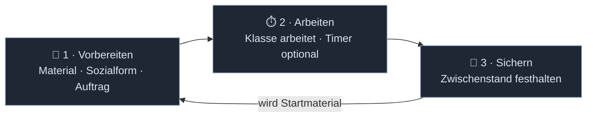

# 0 · Wie Toolio funktioniert — vom Kundenauftrag zur fertigen Lösung

> **Das ist die wichtigste Seite der gesamten Dokumentation.**
> Wer sie gelesen hat, versteht Toolio als Produkt — nicht als Sammlung von Werkzeugen.
> Sie erzählt einen echten **Kundenauftrag** als **Kette von Arbeitszyklen** im
> Informatikunterricht. Keine Technik, keine Klassen, keine APIs. Nur das Produkt.
>
> Wichtig vorweg: Toolio schreibt der Lehrkraft **keinen festen Ablauf** vor. Diese Seite
> zeigt darum nicht *den einen* Weg, sondern **wie frei** der Weg ist.

---

## Das mentale Modell in einem Satz

Toolio ist eine Moodle-Aktivität, in der die Lehrkraft **Arbeitszyklen** inszeniert: Sie
**bereitet** eine Aufgabe vor, die Klasse **arbeitet** live daran, das Ergebnis wird
**gesichert** — und diese Sicherung wird zum **Startmaterial des nächsten Zyklus**. Diese
Kette aus gesicherten Zwischenständen *ist* die Stunde. Mehr Motor ist es nicht; alles
Weitere ist Variation.

---

## Wozu das Ganze — die eine Lücke in Moodle

Moodle ist an berufsbildenden Schulen stark in der Verwaltung, aber **schwach dort, wo
handlungsorientierter Unterricht gemeinsames, gleichzeitiges Arbeiten verlangt**:
Kollaboration ist Moodles größte Schwäche, Einstellungen sind schwer auffindbar, die
Bedienung überladen. Die einzelnen Bausteine liegen verstreut über Aktivitäten und Tabs.

Toolio **ersetzt Moodle nicht** — es schließt genau diese eine Lücke: Es bündelt die
gemeinsame Arbeit in **einer** Aktivität und gibt ihr den Takt. Hintergrund und Belege:
[2 · Problemraum Moodle](02-problemraum-moodle.md).

---

## Die eine Entscheidung, die Toolio geprägt hat

Beim Entwurf stand immer wieder dieselbe Frage im Raum:

> **Wie viel geben wir vor — und wie viel trauen wir den Lehrkräften zu?**

Man hätte Toolio als **Schiene** bauen können: Phase 1, Phase 2, Phase 3 — bitte hier
entlang. Bequem für Einsteiger, aber eine Bevormundung für alle, die ihren Unterricht kennen.

Toolio hat sich für das Gegenteil entschieden: **so wenig Vorgabe wie möglich.** Die Lehrkraft
steigt über etwas ein, das sie ohnehin im Kopf hat — eine **didaktische Methode** —, oder greift
**direkt zum Werkzeug**. Beide Wege sind gleichwertig. Die didaktische Theorie dahinter (die
[vollständige Handlung](04-vollstaendige-handlung.md)) ist eine **Linse, kein Geländer**:
Wer in Phasen denkt, findet sie wieder; wer nicht, wird nie danach gefragt.

> Das ist keine technische Eigenschaft. Es ist eine Haltung: **Toolio vertraut der Lehrkraft.**

---

## Der Takt jeder Aktivität — Vorbereiten, Arbeiten, Sichern

Jedes Werkzeug in Toolio läuft im selben Dreiklang. Das ist das **didaktische Modell** —
*was* in einer Aktivität passiert. Es hat **eigene Symbole** (📝 ⏱️ 💾), damit es sich klar
von der Bedienung (dem Switch, weiter unten) unterscheidet.

| Takt | Was passiert |
|---|---|
| 📝 **1 · Vorbereiten** | Werkzeug (oder Methode) wählen, **Material laden** — beliebiges eigenes Material, auch direkt aus der **Moodle-Dateiablage** des Kurses —, **Sozialform** festlegen und bei Bedarf **pro Gruppe differenzieren**, Erwartungshorizont bzw. Kriterien hinterlegen. |
| ⏱️ **2 · Arbeiten** | Die Klasse arbeitet live; bei Bedarf schaltet die Lehrkraft einen **Timer** zu. Sie **beobachtet** alle Ergebnisse zugleich, **betritt** einzelne Gruppen-Boards als Teilnehmer:in und gibt **gezielt pro Gruppe** Hinweise. |
| 💾 **3 · Sichern** | Ein Klick hält das Ergebnis als **Zwischenstand** fest. Es bleibt für die Klasse sichtbar — und wird zum **Baustein des nächsten Takts**. |

**Sichern heißt nicht einbetonieren.** Ein Zwischenstand wird intern als **bearbeitbares
Format** gehalten (Excalidraw-kompatibles JSON), bleibt also revidierbar; Korrekturen an einer
Sicherung **fließen in die Folgeschritte nach**. Als Datei (SVG/PNG/PDF) wird erst **beim
Download** gerendert.

### Verkettung — warum die Kette die Stunde trägt

Das Gesicherte aus Takt 3 ist das **Startmaterial** für das nächste Werkzeug. So entsteht aus
einzelnen Aktivitäten eine **Kette**: Anforderungen sammeln → Sichern → auf dieser Basis eine
Lösung entwerfen → Sichern → bewerten. Die Verkettung lässt sich **vorab planen** oder
**spontan** verlängern, wenn die Stunde es verlangt.

Eine Toolio-Aktivität hält **eine** solche Kette. Wird sie zu lang, legt die Lehrkraft ein
**zweites Toolio** im selben Kurs an, das auf die gesicherten Ergebnisse des ersten
**zugreifen** kann. Die Faustregel ist Übersichtlichkeit: **zu viele** Toolios zersplittern,
**zu wenige** erzeugen zu komplexe Ketten.

> *Beispiel:* Das gesicherte **Tabellenkonzept** aus der Entwurfsstunde liegt im Toolio
> „Planung". Zwei Wochen später öffnet Herr Falk ein neues Toolio „Umsetzung" und zieht dieses
> Konzept als Startmaterial herein — ohne es zu kopieren. Die Kette reißt nicht, bleibt aber
> übersichtlich.

---

## Die drei Ansichten — der ganze Bedienkern

Der Takt (📝 ⏱️ 💾) ist das *didaktische Modell* — *was* passiert. Die **drei Ansichten**
(🟢 🔵 🟡) sind die **Bedienung** — *womit* die Lehrkraft den Takt steuert. Das eine ist der
**Rhythmus**, das andere der **Schalter**; sie greifen so ineinander:

| Ansicht (Bedienung) | Takt-Schritt (Modell) | Was die Lehrkraft hier tut |
|---|---|---|
| 🟢 **LK ON** — Konfigurieren | 📝 Vorbereiten · 💾 Sichern | Methode/Werkzeug vorbereiten, Material laden, Ergebnisse sichern. Bearbeiten-Schalter **an**. |
| 🔵 **LK OFF** — Beobachten & Mitmachen | ⏱️ Arbeiten (beobachten) | Zusehen, moderieren, **freigeben**, einzelne Boards als Teilnehmer:in betreten. Schalter **aus**. |
| 🟡 **Schüler** — Arbeiten & Teilen | ⏱️ Arbeiten (die Klasse) | Die Ansicht der Klasse: **ein** Werkzeug, voller Fokus, mitgestalten und einreichen. |

Moodle entscheidet anhand der Rolle, wer welche Ansicht sieht. Die Klasse öffnet **dieselbe
Aktivität** wie die Lehrkraft — kein zweiter Link, keine App.

---

## Der Einstieg: eine Wolke aus Methoden

Öffnet die Lehrkraft die Aktivität, schwebt vor ihr eine **Wolke didaktischer Methoden**:
*Gruppenarbeit, Brainstorming, Placemat, Think-Pair-Share, Recherche, Lernstandscheck, Exit
Ticket, Mindmap, Stationenarbeit, Peer-Feedback, Reflexion, Einzelarbeit …*

Ein Klick auf eine Methode **löst sie in ein oder mehrere Werkzeuge auf**:

| Methode | löst auf zu … |
|---|---|
| Brainstorming | 📋 Board |
| Placemat | 📋 Board + 👥 Gruppentool |
| Stationenarbeit | 👥 Gruppentool + 📋 Board |
| Recherche | 🤖 KI-Chatbot |
| Exit Ticket | ❓ Abfrage |
| Peer-Feedback | ⭐ Bewertung |
| Einzelarbeit | *(kein Werkzeug — reine Sozialform)* |

Wer keine Methode braucht, **greift direkt zum Werkzeug**. Beides mündet in denselben Takt:
📝 vorbereiten, ⏱️ arbeiten, 💾 sichern.

---

## Der Kundenauftrag

Herr Falk unterrichtet **Informatik** an einer Berufsschule. Seine Klasse hat einen echten
Auftrag auf dem Tisch: Die **Fahrradmanufaktur „Rad & Tat"** möchte eine **Excel-Kalkulation**
für individuell konfigurierte Räder — Angebot, Rabattstaffel, Rechnung, Umsatzübersicht.
Inhaberin Frau Ostermann will am Ende etwas, das sie selbst bedienen kann.

Herr Falk geht den Auftrag **nicht** als starren Phasenplan an, sondern als **Kette von
Arbeitszyklen** — jeder im selben Takt: vorbereiten, arbeiten, sichern. Das Gesicherte trägt
jeweils den nächsten Schritt.

### Zyklus 1 · Den Auftrag verstehen — *Methode Placemat*

**Vorbereiten:** Herr Falk klickt in der Wolke auf **Placemat**. Toolio erkennt: Placemat heißt
**Gruppentool + Board** — und verkettet beide. Er teilt Vierergruppen ein und lädt die
**Auftragsbeschreibung als PDF aus der Moodle-Dateiablage** an den Rand jedes Boards.

> *Alternative Eröffnung:* Statt des PDFs hätte Herr Falk den **KI-Chatbot als Kundin
> „Frau Ostermann"** auftreten lassen können. Die Klasse fragt die Anforderungen dann im
> Gespräch heraus — ein Chat wie in WhatsApp, in den er sich jederzeit einklinken kann.

**Arbeiten:** In **🔵 LK OFF** überblickt Herr Falk alle Gruppen-Boards. Bei einer Gruppe, die
nur „Preis mal Anzahl" schreibt, **betritt er ihr Board** und fragt nach der Rabattstaffel.

**Sichern:** Jede Gruppe sichert ihre **Anforderungsliste**. Dieser Zwischenstand ist das
Material für den nächsten Zyklus.

### Zyklus 2 · Die Lösung entwerfen — *direkt das Board*

**Vorbereiten:** Kein Umweg über eine Methode. Herr Falk wählt **direkt das Board** — diesmal
ein **gemeinsames Tafelbild** — und zieht die **gesicherten Anforderungslisten aus Zyklus 1**
als Ausgangsmaterial hinein.

**Arbeiten:** Die ganze Klasse skizziert den Aufbau der Tabelle — Eingabefelder, Berechnungen,
Ausgabe. Vier Hände, dieselbe Fläche, in Echtzeit.

**Sichern:** Das **Tabellenkonzept** wird gesichert und dient als Bauplan für die eigentliche
Excel-Umsetzung.

> **Gleichwertig, nicht Notbehelf:** Der direkte Werkzeug-Einstieg (Zyklus 2) und der
> Methoden-Einstieg (Zyklus 1) führen an dieselbe Stelle. Wer weiß, was er will, klickt es
> direkt an.

### Zyklus 3 · Kurz nachfassen — *spontan eingeschoben*

Mitten in der Umsetzung beschleicht Herrn Falk ein Verdacht: Verstehen wirklich alle den
Unterschied zwischen **absolutem und relativem Zellbezug**? Er schiebt **ohne Vorbereitung**
eine **Abfrage** ein, tippt zwei Fragen ein, gibt sie **einzeln** frei. Die Ergebnisse laufen
live ein — als Auswertung seiner Wahl, bis hin zur Wortwolke. Vorbereitungszeit: null.

> **Vertrauen statt Plan:** Ein Werkzeug lässt sich in Sekunden mitten in die Kette
> einschieben — genau dann, wenn die Lehrkraft es braucht.

### Zyklus 4 · Bewerten lassen — *Peer-Feedback*

**Vorbereiten:** Als die ersten Excel-Lösungen gesichert sind, wählt Herr Falk **Peer-Feedback**.
Die **Bewertung** ist dabei eine **Abfrage mit Kriterien**: *Funktioniert die Rabattstaffel? Ist
die Tabelle für Frau Ostermann bedienbar? Stimmen die Formeln?* — als gewichtete Matrix.

**Arbeiten:** Jede Gruppe bewertet die **gesicherte Lösung** einer anderen entlang dieser
Kriterien.

**Sichern:** Auf dem **gemeinsamen Tafelbild** blendet Herr Falk die Auswertung ein und stellt
die stärkste Lösung als Referenz daneben — die Sicherung der ganzen Sequenz.

---

## Zwei freie Achsen: Material und Sozialform

Zwei Dinge legt die Lehrkraft in **jedem** Takt frei fest — unabhängig vom Werkzeug:

- **Material:** beliebig. Bestehendes Unterrichtsmaterial lässt sich einbinden, Toolio greift
  direkt auf die **Dateiablage des Moodle-Kurses** zu. Kein Zwang, alles neu in Toolio anzulegen.
- **Sozialform:** beliebig und **wechselbar**. Einzel-, Paar-, Gruppen- oder Plenumsarbeit —
  und sie darf sich **von Zyklus zu Zyklus ändern** (erst Einzel, dann Gruppe). Die
  Gruppeneinteilung übernimmt das **Gruppentool**, das auch spontane Änderungen abfedert, wenn
  z. B. jemand fehlt.

---

## Und die sechs Phasen?

Herr Falk hat, ohne es zu betonen, die ganze **vollständige Handlung** durchlaufen:
informiert (Auftrag verstehen), geplant und entschieden (Lösung entwerfen), durchgeführt
(gebaut), kontrolliert (Abfrage) und bewertet (Peer-Feedback). **Toolio hat ihn nie dazu
gezwungen.** Die Phasen waren die Landkarte im Hintergrund — nützlich zur Orientierung, nie
ein Zwang. Genau so ist es gewollt.

---

## Was die Klasse erlebt

Die Schüler:innen sehen zu jedem Zeitpunkt **nur das eine aktive Werkzeug** — keine Menüs,
keine Methodenauswahl. Richtet die Lehrkraft gerade den **ersten** Schritt ein, zeigt ein
ruhiger **Wartebildschirm**: „Deine Lehrkraft bereitet vor…". Wechselt Herr Falk das Werkzeug,
**aktualisiert sich ihre Ansicht von selbst** — ohne Neuladen, ohne Ankündigung.

Was einmal **gesichert** ist, **bleibt sichtbar**: das eigene Gruppenergebnis, das gemeinsame
Tafelbild, die Auswertung einer Abfrage, bereitgestelltes Material. Die Klasse verliert nie den
Faden — die Kette der Zwischenstände wächst vor ihren Augen. Der digitale Raum verhält sich wie
das Klassenzimmer: Alle erleben im selben Moment dasselbe.

---

## Was diese Geschichte erklärt

| Frage | Antwort aus der Geschichte |
|---|---|
| **Was ist der Motor?** | Ein Takt pro Aktivität: **vorbereiten → arbeiten → sichern**. Die Stunde ist die Kette dieser Takte. |
| **Warum das Sichern?** | Ein gesicherter Zwischenstand wird zum **Startmaterial des nächsten Werkzeugs** — so verketten sich Aktivitäten. |
| **Warum ist Sichern revidierbar?** | Der Zwischenstand bleibt bearbeitbar (JSON); Korrekturen fließen nach. Kein Beton, ein Meilenstein. |
| **Warum ein Methoden-Einstieg?** | Weil Lehrkräfte in Methoden denken, nicht in Werkzeug-Menüs. |
| **Warum trotzdem der direkte Tool-Weg?** | Wer weiß, was er will, soll es sofort anklicken. Beide Wege sind gleichwertig. |
| **Warum ein zweites Toolio?** | Eine Aktivität hält eine Kette; zu lange Ketten teilt man auf — ein anderes Toolio im Kurs greift auf gesicherte Ergebnisse zu. |
| **Warum löst eine Methode Werkzeuge auf?** | Eine vertraute Methode bündelt in einem Klick die passenden Werkzeuge (Placemat = Board + Gruppentool). |
| **Warum sind die Phasen nur optional?** | Toolio bevormundet nicht. Die vollständige Handlung ist Linse, kein Geländer. |
| **Warum drei Ansichten?** | Vorbereiten (🟢), beobachten/freigeben (🔵), arbeiten (🟡) — ein vertrauter Schalter, überall gleich. |
| **Warum sieht die Klasse nur ein Werkzeug?** | Die Lehrkraft gibt den Takt vor, nicht das Menü. Die Klasse denkt, statt zu navigieren. |
| **Warum fühlt sich alles „live" an?** | Jede Aktion der Lehrkraft kommt sofort bei allen an — ohne Neuladen. |
| **Warum bleibt Moodle im Zentrum?** | Toolio ersetzt nichts. Es orchestriert die Stunde und arbeitet im vertrauten Kurs. |

Wenn eine Leserin nach fünf Minuten erklären kann, **wie frei sich Unterricht mit Toolio
anfühlt**, hat diese Seite ihre Aufgabe erfüllt.

---

## Wohin von hier

Diese Seite ist die **Landkarte**; die folgenden Dokumente sind die Detailkarten:

| Aus der Geschichte | Vertiefung |
|---|---|
| Die eine Lücke, die Toolio schließt | [2 · Problemraum Moodle](02-problemraum-moodle.md) |
| Die drei Ansichten (🟢/🔵/🟡) | [5 · Bedienkonzept Switch](05-bedienkonzept-switch.md) |
| Wie es aussehen soll (weniger ist mehr) | [8 · UI/UX-Prinzipien](08-ui-ux-prinzipien.md) |
| Die Phasen als optionale Linse | [4 · Vollständige Handlung](04-vollstaendige-handlung.md) |
| Methode „Placemat" → Gruppen | [Gruppentool](../03-werkzeuge/01-gruppentool.md) |
| Chatbot als Kundin (Zyklus 1) | [KI-Chatbot](../03-werkzeuge/02-chatbot.md) |
| Board & Tafelbild (Zyklus 1 & 2) | [Board](../03-werkzeuge/03-board.md) |
| Abfrage (Zyklus 3) | [Abfrage](../03-werkzeuge/04-abfrage.md) |
| Peer-Feedback / Bewertung (Zyklus 4) | [Bewertung](../03-werkzeuge/05-bewertung.md) |
| Weitere Unterrichtssituationen | [7 · Szenarien](07-szenarien.md) |
| Wie das „live" technisch entsteht | [2 · Realtime-Architektur](../02-architektur/02-realtime.md) |

---

## Offene Fragen

- **Architektur teils per ADR verankert:** Das Datenmodell (Zyklus-Kette, Sicherung als
  JSON-Snapshot, kursweite Verkettung zwischen mehreren Toolios) ist als
  [ADR-0003](../adr/0003-datenmodell-drei-takt-verkettung.md) *(Vorgeschlagen)* aufgesetzt.
  Noch offen als eigene ADR: „Rendern erst beim Download" (SVG/PNG/PDF).
- Soll die Methoden-Wolke eine **feste Kernliste** haben oder pro Kurs/Fach anpassbar sein?
- Bekommt jede Werkzeug-Seite einen festen Rückverweis „→ Zyklus in *Wie Toolio
  funktioniert*" (Phase 2 dieses Umbaus)?
