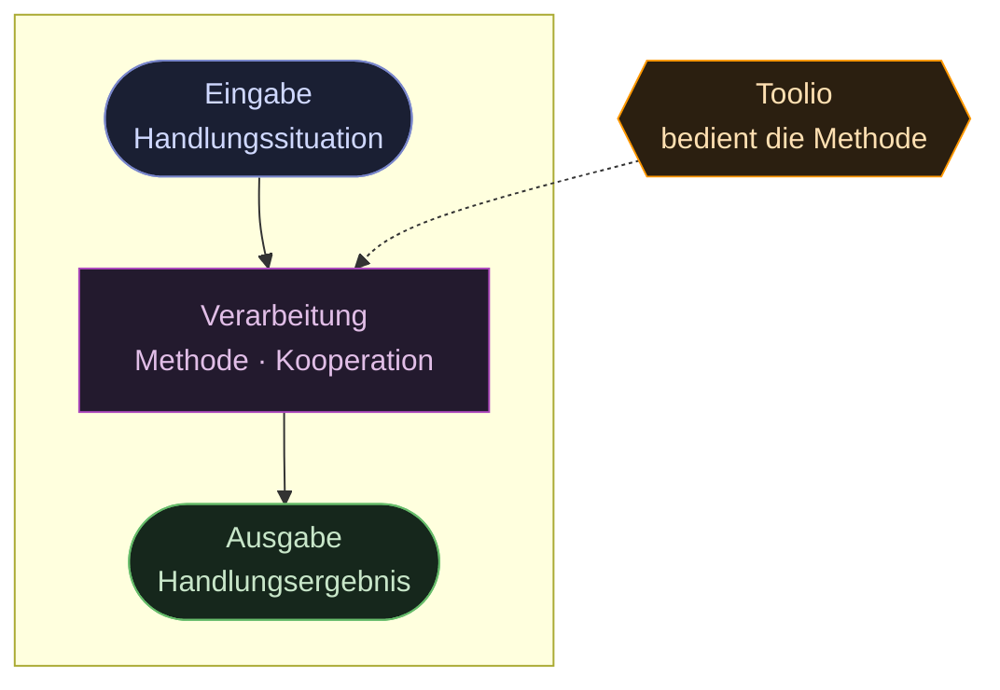
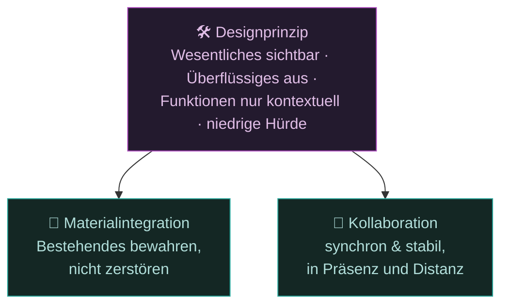

# 3 · Idee und Zielbild

Handlungsorientierter Unterricht folgt demselben Grundmuster wie das informatische
**EVA-Prinzip**: Auf eine **Eingabe** folgt eine **Verarbeitung**, daraus entsteht
eine **Ausgabe**. Übertragen auf die Lernsituation heißt das:

Input (Auftrag) und Output (Produkt) gibt die Lehrkraft didaktisch vor — **dazwischen
liegt die Methode**, also das gemeinsame Erarbeiten. Genau diese Methode macht **Toolio**
einfach, sichtbar und kooperativ bedienbar.

## Lösungsprinzipien

Ein **Designprinzip** bildet das Dach; darunter tragen zwei Säulen die Lösung —
**Materialintegration** und **Kollaboration**.

- **Designprinzip** — Wesentliches sichtbar machen, Überflüssiges ausblenden,
  Funktionen nur **kontextuell** zeigen, niedrige Einstiegshürde.
- **Materialintegration** — bestehende Unterrichtsmaterialien und gewachsene Kursstrukturen
  bleiben **unangetastet**: direkt nutzbar, automatisiert über die Dateiablage,
  keine Doppelpflege. Toolio ergänzt, ohne Vorhandenes zu zerstören.
- **Kollaboration** — synchron in Präsenz und Distanz, bewährte Drittanbieter-Konzepte
  nativ integriert, Gruppenarbeit stabil und einfach.

## Zielbild in einem Satz
Ein Plugin, das die **Kollaborationslücke** von Moodle schließt und die
**vollständige Handlung** durchgängig mit einfachen, rollenklaren Werkzeugen begleitet.

> Wie sich die Werkzeuge auf die Handlungsphasen verteilen:
> siehe [Vollständige Handlung](04-vollstaendige-handlung.md).
> Wie die Bedienung einfach bleibt: siehe [Bedienkonzept](05-bedienkonzept-switch.md).
