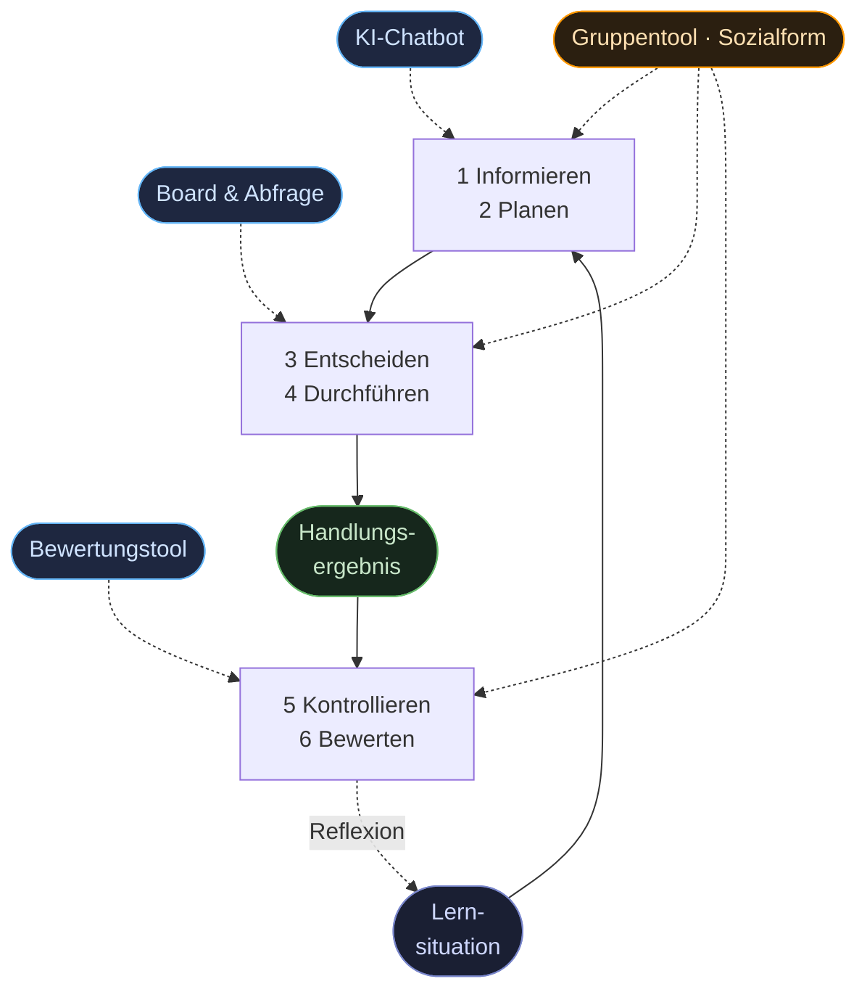

# 4 · Vollständige Handlung (didaktische Klammer)

Die vollständige Handlung ist die **didaktische Klammer** für die gesamte Plugin-Suite —
und gleichzeitig die Verarbeitungsebene des [EVA-Prinzips](03-zielbild.md):
Die Lernsituation ist der **Input**, das Handlungsergebnis der **Output**,
die sechs Phasen bilden die **Verarbeitung**. Das Handlungsergebnis entsteht am
Ende von Phase 4 — Kontrollieren und Bewerten wirken auf das fertige Produkt.

> Die Zuordnung der Tools zeigt ihren **Schwerpunkt**, keine Exklusivität.
> Das **Gruppentool** greift als einziges Werkzeug phasenübergreifend ein —
> es legt die Sozialform fest und steuert damit alle anderen.

So entsteht ein durchgängiger Werkzeug-Fluss: Jede Phase hat ihr **führendes
Werkzeug**, während das **Gruppentool** als Sozialform-Steuerung den Kreislauf
zusammenhält. Kein Werkzeug steht für sich — alle dienen **derselben Handlung**.

> Wie diese Werkzeuge im Detail funktionieren: [03-werkzeuge/](../03-werkzeuge/).
