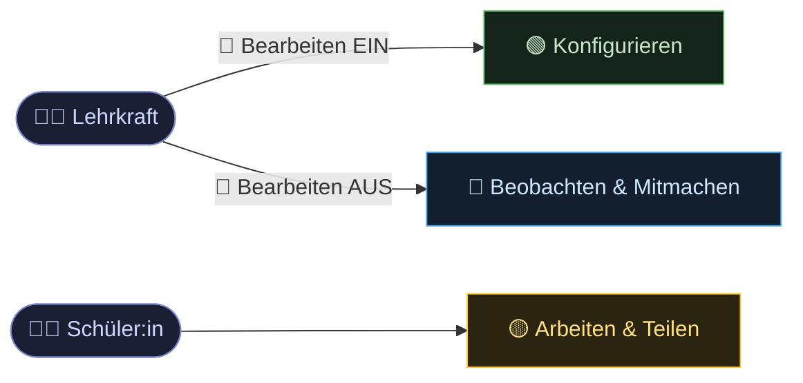

# 5 · Bedienkonzept: Switch ON / OFF

Lehrkräfte kennen den **Moodle-Bearbeitungsschalter** — er trennt Konfigurieren
von Ansehen. Toolio denkt dieses Prinzip weiter: aus zwei Zuständen werden
**drei klar getrennte Ansichten**, eine davon speziell für Lernende.

> *📎 Diagramm/Medium „switch.png" — lokal in Obsidian verfügbar, nicht in Git.*

Der entscheidende Unterschied: Im **OFF-Modus** schlüpft die Lehrkraft in die
erweiterte Schülerrolle — sie sieht alle Gruppen gleichzeitig und kann moderierend
mitarbeiten (beim **Board** etwa einen **Erwartungshorizont** eintragen), ohne die
Konfiguration zu berühren.

## Warum kein Einstellungstab?
*Status: akzeptiert (2026-06-24)*

Klassische Einstellungsreiter wurden **verworfen**: zu viele Klicks, Doppelbelegung
von Begriffen, Verwirrung. Der eine Schalter senkt die Einstiegshürde und hält die
Bedienung über alle Werkzeuge **konsistent** — der Preis dafür ist, dass jede der
drei Ansichten dreifach durchdacht und getestet werden muss.

## Verbindlich für die Umsetzung
**Jedes Werkzeug implementiert genau diese drei Ansichten** — ohne Ausnahme.
Siehe Spezifikationen unter [03-werkzeuge/](../03-werkzeuge/).
