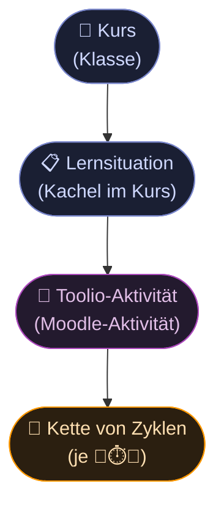
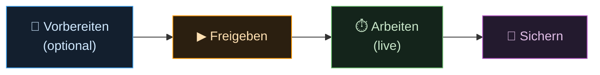
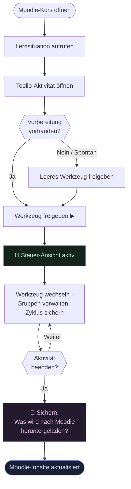
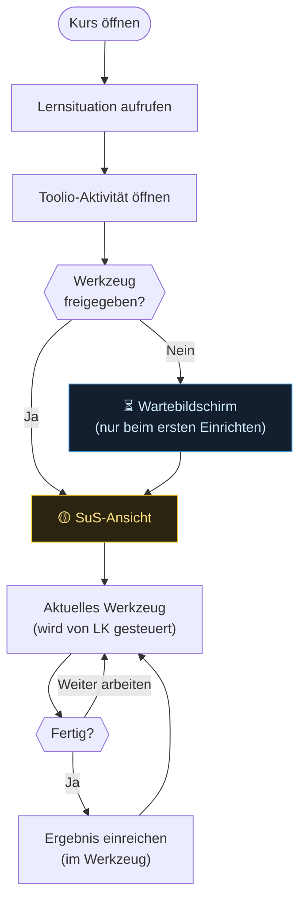
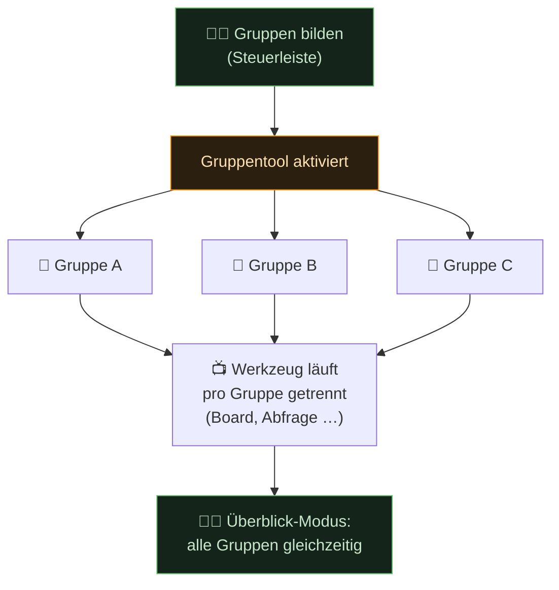
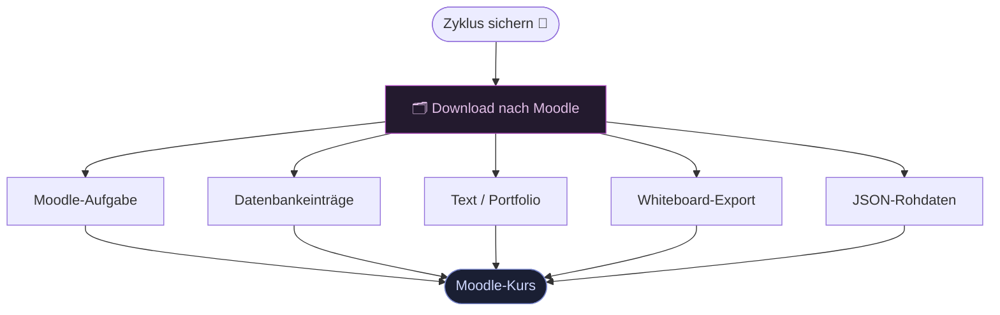

# 6 · Die Aktivität live führen — Durchführung & Nachbereitung

Diese Seite zeigt, wie eine **Toolio-Aktivität** live im Unterricht läuft: die
Durchführung selbst, die Bedienoberfläche der Lehrkraft und was danach in Moodle
bleibt. Der Motor dahinter (der **Drei-Takt** 📝 vorbereiten → ⏱️ arbeiten →
💾 sichern und die **Verkettung** der Zyklen) steht in
[00 · Wie Toolio funktioniert](00-wie-toolio-funktioniert.md); der Bedien-**Switch**
in [05 · Bedienkonzept Switch](05-bedienkonzept-switch.md). Hier geht es um die
**Live-Ebene**.

Moodle bleibt dabei vollständig erhalten: Kurse, Nutzer, Rechte, Materialien,
Bewertungen laufen weiter wie gewohnt. Toolio fügt keinen zweiten Kosmos hinzu —
es blendet während der Durchführung nur eine gemeinsame, gesteuerte Arbeitsfläche ein.

> Die Lehrkraft ersetzt kein einziges Moodle-Element — sie führt es live.

## Durchführung ist flüchtig, die Aktivität ist der Anker



Eine **Lernsituation** kann mehrere Toolio-Aktivitäten enthalten — eine pro
Unterrichtseinheit oder Themenblock. Jede Aktivität besteht aus einer **Kette von
Arbeitszyklen** und kann mehrfach durchgeführt werden, z. B. für verschiedene
Klassen. Die **Durchführung** ist das flüchtige Ereignis; die **Aktivität** ist der
dauerhafte Anker.

## Moodle als Materialquelle

Die Aktivität greift auf den gesamten Kursinhalt zu, verändert ihn jedoch **nicht
während der Durchführung**. Moodle liefert das Startmaterial für den ersten Takt
(📝 vorbereiten):

| Moodle-Quelle | Nutzung in der Aktivität |
|---|---|
| Dateien, H5P | als eingebetteter Impuls in einem Zyklus |
| Aufgaben | als Arbeitsauftrag mit direktem Link |
| Foren, Glossare, Datenbanken | als kollaborativer Arbeitsraum |
| Tests | als Abfrage oder Lernstandscheck |
| Whiteboards | als geteilte Arbeitsfläche |

Alles bleibt im Original. Nichts wird kopiert oder ersetzt.

## Der Ablauf einer Durchführung

Der inhaltliche Rhythmus ist der **Drei-Takt** aus [00](00-wie-toolio-funktioniert.md).
Die Live-Ebene fügt nur zwei Handgriffe hinzu, die es ohne Klasse nicht gäbe —
das **Freigeben** und das **Sichern & Herunterladen**:



- **Vorbereiten (📝)** — Werkzeug wählen, Material verlinken, Sozialform festlegen.
  Vollständig optional: Wer spontan unterrichtet, gibt direkt frei.
- **Freigeben (▶)** — die Lehrkraft schaltet das Werkzeug für die Klasse frei
  (Switch 🔵 LK OFF); die SuS erhalten automatisch Zugang über dieselbe
  Moodle-Aktivität.
- **Arbeiten (⏱️)** — die Klasse arbeitet; die Lehrkraft beobachtet und moderiert
  über die Steuer-Ansicht. Bei Bedarf schaltet sie einen **Timer** zu.
- **Sichern (💾)** — der Zwischenstand wird gesichert und dient als Startmaterial
  des nächsten Zyklus; auf Wunsch wird er nach Moodle heruntergeladen.

## Userflow: Lehrkraft



Die Lehrkraft verlässt Moodle nie — sie bleibt in der vertrauten Kursnavigation.
Die Aktivität öffnet sich als Ansicht innerhalb der Moodle-Aktivität,
nicht als externes Tool.

## Userflow: Schülerinnen und Schüler

SuS öffnen **dieselbe Moodle-Aktivität** wie die Lehrkraft — Moodle entscheidet
anhand der Rolle, welche Ansicht erscheint. Kein separater Link, kein QR-Code,
keine extra App. Der Einstieg ist identisch mit jedem anderen Moodle-Element.



Der Wartebildschirm erscheint nur, solange die Lehrkraft das erste Werkzeug noch
einrichtet — kein leerer Bildschirm, kein Fehler. Sobald freigegeben ist,
aktualisiert sich die Ansicht automatisch (SSE, kein Reload). Gesicherte
Zwischenstände bleiben sichtbar: Die Kette der Ergebnisse wächst vor der Klasse.

## Die Steuer-Ansicht der Lehrkraft (🔵 LK OFF)

Die Steuer-Ansicht folgt dem Prinzip **Fokus + Kontext**:
Das aktive Werkzeug füllt den Hauptbereich vollständig aus.
Eine schlanke **Steuerleiste** am oberen oder linken Rand gibt der Lehrkraft
Kontrolle über den Gesamtfluss — ohne vom laufenden Unterricht abzulenken.
Sie ist die Bedienform des Switch-Zustands **🔵 LK OFF** (Beobachten & Mitmachen).

```
┌─────────────────────────────────────────────────────────────┐
│  🔵 Werkzeug: [Board ▼]   Zyklus: [2 · Umsetzung]          │
│  Gruppen: [Keine ▼]   Klasse: 📊 23 aktiv   [💾 Sichern]   │
├─────────────────────────────────────────────────────────────┤
│                                                             │
│                   📺 Aktives Werkzeug                       │
│              (Board / Abfrage / H5P / …)                    │
│                  in voller Bildschirmgröße                  │
│                                                             │
│   ┌──────────────────────────────────────┐                  │
│   │  👁 SuS-Vorschau (Miniatur, alle Grp)│                  │
│   └──────────────────────────────────────┘                  │
└─────────────────────────────────────────────────────────────┘
```

| Bereich | Inhalt | Zweck |
|---|---|---|
| Steuerleiste | Werkzeug, Zyklus, Gruppen, Status | Steuerung ohne Ablenkung |
| Hauptbereich | aktives Werkzeug in voller Größe | Fokus auf den Inhalt |
| SuS-Vorschau | Miniaturansicht aller SuS/Gruppen | Klassenüberblick ohne Umschalten |

## Die SuS-Ansicht (🟡)

SuS sehen stets **nur das aktive Werkzeug** — keine Steuerelemente, keine
Werkzeugauswahl. Der Cognitive Load bleibt minimal.

Wenn die Lehrkraft das Werkzeug wechselt, aktualisiert sich die SuS-Ansicht
automatisch — ohne Hinweis, ohne Reload, nahtlos.
Das Prinzip: **Überraschung ist besser als Ankündigung** — die Lehrkraft
moderiert live, nicht über Systemnachrichten.

## Gruppenarbeit live steuern

Die Gruppensteuerung erfolgt über das **Gruppentool** aus der Steuerleiste.
Sobald Gruppen aktiv sind, läuft jedes Werkzeug **pro Gruppe getrennt**.
Die Lehrkraft wechselt über die SuS-Vorschau zwischen Gruppenansichten —
oder aktiviert den Überblick-Modus, der alle Gruppen gleichzeitig zeigt.



Im Überblick-Modus (der Bedienform von **🔵 LK OFF**) kann die Lehrkraft bei
Bedarf moderierend eingreifen — z. B. einen Erwartungshorizont auf einem
Gruppen-Board ergänzen — ohne die Konfiguration eines Werkzeugs zu öffnen.

## UX-Ansätze im Vergleich

### ✅ Fokus-Modus mit Steuerleiste — *empfohlen*

Ein Werkzeug dominiert den Hauptbereich. Die Steuerleiste bleibt kompakt am Rand.

**Vorteile:** niedrige kognitive Last, klarer Fokus, funktioniert auch spontan.  
**Nachteile:** Lehrkraft sieht nie mehrere Werkzeuge gleichzeitig; erfordert
eine gut durchdachte Steuerleiste.

---

### Werkzeug-Stepper

Lineare Abfolge, Lehrkraft klickt sich durch wie eine Slideshow.

**Vorteile:** klare Struktur, kaum Planung nötig, für Einsteiger gut.  
**Nachteile:** zu starr für spontanen Unterricht; blockiert Anpassung mitten im Zyklus.

---

### Kachel-Dashboard

Alle verfügbaren Werkzeuge als wählbare Kacheln sichtbar.

**Vorteile:** maximale Flexibilität, kein Vorzwang.  
**Nachteile:** hohe kognitive Last; SuS-Orientierung unklar; nicht für routinefreie Lehrkräfte.

---

### Timeline-Modus

Vorbereiteter Zeitplan läuft mit Timer pro Zyklus automatisch ab.

**Vorteile:** diszipliniert, selbstlaufend, entlastet die Lehrkraft.  
**Nachteile:** Spontanität ausgeschlossen; technisch aufwändig; kein Puffer.

---

### Split-View (Steuerung + SuS-Vorschau nebeneinander, vergrößert)

Beide Oberflächen immer parallel sichtbar, nicht nur als Miniatur.

**Vorteile:** voller Überblick ohne Umschalten.  
**Nachteile:** zu viel gleichzeitig; auf kleinen Bildschirmen (Laptop) unbrauchbar.

---

> **Entscheidung:** Der Fokus-Modus mit Steuerleiste wird umgesetzt.
> Er kombiniert niedrige kognitive Last mit Spontanität und skaliert
> vom vorbereiteten bis zum vollständig improvisierten Unterricht.
> *Status: akzeptiert (2026-06-26)*

## Sichern — was bleibt in Moodle?

Am Ende eines Zyklus **sichert** (💾) die Lehrkraft den Zwischenstand. Er dient als
Startmaterial des nächsten Zyklus und kann zusätzlich **nach Moodle heruntergeladen**
werden. Toolio archiviert nichts stillschweigend — die Lehrkraft entscheidet, was
dauerhaft in Moodle landet.



Ergebnisse können kombiniert gespeichert werden (z. B. Aufgabe + Datenbankeinträge
für denselben Zyklus). Sichern heißt nicht einbetonieren: Der gesicherte Stand
bleibt als JSON revidierbar; ein festes Format entsteht erst beim Download.

## Verbindung zu Switch und Drei-Takt

Der [Switch](05-bedienkonzept-switch.md) (🟢 LK ON · 🔵 LK OFF · 🟡 Schüler) regelt,
**wer gerade wie bedient** — innerhalb jedes Werkzeugs. Der
[Drei-Takt](00-wie-toolio-funktioniert.md) (📝 → ⏱️ → 💾) regelt, **wie der Inhalt
voranschreitet**. Beide Ebenen sind orthogonal: kein Konflikt, kein Widerspruch.

| Switch-Ansicht | Rolle in der Durchführung |
|---|---|
| 🟢 LK ON (Konfigurieren) | Werkzeug einrichten — vor dem Freigeben (📝) |
| 🔵 LK OFF (Beobachten & Mitmachen) | Steuer-Ansicht: moderieren, alle Gruppen sehen (⏱️) |
| 🟡 Schüler (Arbeiten & Teilen) | SuS-Ansicht: ein Werkzeug, voller Fokus |

> Der Switch beantwortet die Frage **innerhalb eines Werkzeugs**.
> Der Drei-Takt und die **Verkettung** der Zyklen beantworten sie **zwischen den
> Werkzeugen** — ein gesicherter Stand wird zum Start des nächsten.

Wie die Werkzeuge inhaltlich auf die Schritte der vollständigen Handlung wirken:
→ [Vollständige Handlung](04-vollstaendige-handlung.md)
