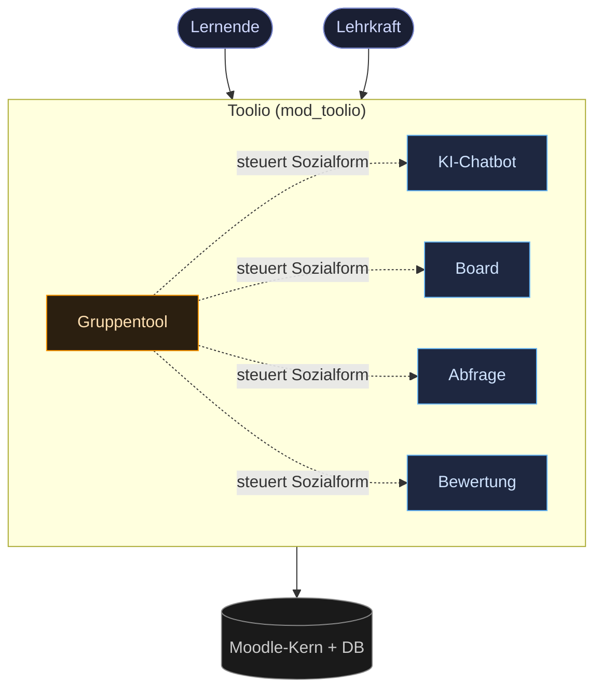

# Architektur — Systemüberblick

> Technik **in Worten**, ergänzt durch eingebettete Mermaid-Diagramme.

Kapitel 01 hat geklärt, **was** entsteht und warum. Dieses Kapitel zeigt, **wie** die
fünf Werkzeuge technisch zusammenspielen — und hält die verbindlichen Entscheidungen fest.

> **Entwicklung vs. Produktion:** Die fünf Werkzeuge werden in der Entwicklung als
> **einzelne Plugins** (Prototypen) gebaut und für den Produktivbetrieb zu **Toolio**
> zusammengeführt — final **zwei** Plugins: `mod_toolio` (Monolith mit allen Werkzeugen)
> und `block_toolio` (Sidebar). Details: [4 · Repos & Zusammenführung](../04-umsetzung/01-repos-und-zusammenfuehrung.md).

## Werkzeuge im Überblick

| Werkzeug | Schwerpunkt-Phase | Aufgabe | Realtime | Status |
|---|---|---|---|---|
| Gruppentool | phasenübergreifend | Sozialform & Gruppen festlegen — steuert alle anderen Tools | SSE | Planung |
| KI-Chatbot | Phase 1–2 | rollenbasierte Unterstützung, ohne offenen Webzugriff | SSE | Planung |
| Kollaboratives Board | Phase 3–4 | gemeinsames visuelles Arbeiten (Excalidraw-Room) | WebSocket | Planung |
| Abfrage | Phase 3–4 | Quiz / Umfrage | SSE | Planung |
| Bewertung | Phase 5–6 | Bewertungsmatrix | SSE | Planung |

Wie SSE, WebSocket und Moodle-DB zusammenspielen: [Realtime-Architektur](02-realtime.md).

## Kontext (C1)

## Kapitel dieses Abschnitts
1. [Integration & Laufzeit-Topologie](01-integration-topologie.md) — wie die Suite im Moodle steckt, was wo läuft
2. [Realtime-Architektur](02-realtime.md) — SSE vs. WebSocket, mit Sequenzdiagrammen
3. [Daten & Betrieb](03-daten-betrieb.md) — Zustand, Datenschutz, Hosting

## Entscheidungen
Die verbindlichen Festlegungen stehen direkt in ihrem Heimat-Kapitel:

| Entscheidung | Status | Nachzulesen in |
|---|---|---|
| Realtime über SSE, WebSocket nur fürs Board | Akzeptiert | [2 · Realtime-Architektur](02-realtime.md#entscheidung-realtime-über-sse-websocket-nur-fürs-board) |
| Toggle-Bedienkonzept statt Einstellungstabs | Akzeptiert | [5 · Bedienkonzept](../01-konzept/05-bedienkonzept-switch.md#warum-kein-einstellungstab) |

> Jedes Werkzeug fachlich und technisch im Detail: [03-werkzeuge/](../03-werkzeuge/).

## Werkzeug-Specs (03-werkzeuge/)
Die Einzel-Spezifikationen sind die **Arbeitsgrundlage für die Implementierung**.
Für **jedes** Werkzeug gilt verbindlich:

- **Drei Ansichten** — Schüler · Lehrkraft ON · Lehrkraft OFF → [Bedienkonzept](../01-konzept/05-bedienkonzept-switch.md)
- **Realtime** — SSE als Standard, WebSocket nur fürs Board → [2 · Realtime-Architektur](02-realtime.md)
- **Rollenrechte** — je Werkzeug über Moodle-Capabilities geprüft

Jede Spec folgt demselben Schema: *Zweck · Phase · Ansichten · Realtime · Datenmodell · Rollen · Offene Fragen · Status.* DSGVO ist zentral in den [Rahmenbedingungen](../01-konzept/01-rahmenbedingung.md) geregelt (lokaler Betrieb) — toolspezifische Hinweise nur dort, wo nötig (z. B. KI-Chatbot).

> Zu den Werkzeugen: [Gruppentool](../03-werkzeuge/01-gruppentool.md) · [KI-Chatbot](../03-werkzeuge/02-chatbot.md) · [Board](../03-werkzeuge/03-board.md) · [Abfrage](../03-werkzeuge/04-abfrage.md) · [Bewertung](../03-werkzeuge/05-bewertung.md)
