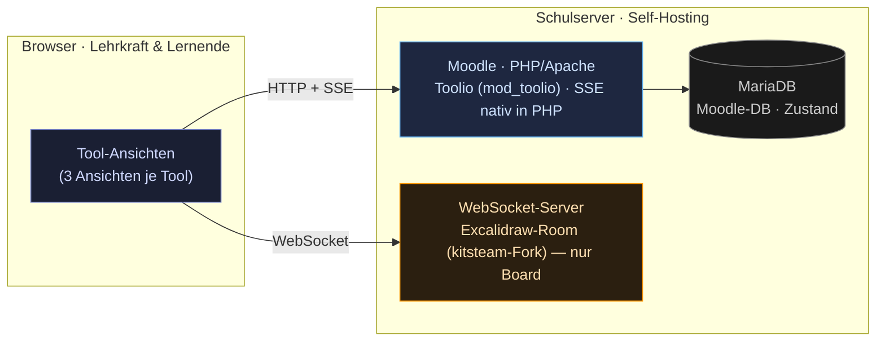

# 1 · Integration & Laufzeit-Topologie

Wie steckt die Suite **im** Moodle — und was läuft **wo**? Diese Frage entscheidet
über Betrieb, Datenschutz und Aufwand. Die Antwort ist bewusst schlank.

## Integration: Moodle-Plugins statt Fremdsystem

Toolio ist ein **natives Moodle-Plugin**, kein angedocktes Fremdsystem. In der
**Entwicklung** entsteht jedes Werkzeug als eigenständiges Plugin (Aktivitätsmodul
`mod_*` bzw. `local_*`); für die **Produktion** werden sie zu **Toolio** (`mod_toolio`)
zusammengeführt (siehe [4 · Repos & Zusammenführung](../04-umsetzung/01-repos-und-zusammenfuehrung.md)).
So oder so nutzt Toolio Moodles eigene Bausteine:

- **Rollen & Rechte** über Moodle-Capabilities (`db/access.php`)
- **Persistenz** über die Moodle-DB (`db/install.xml`)
- **Kursbindung** über Course-Module und Kontext
- **Sprache, Navigation, Theme** aus dem Moodle-Kern

Damit erbt die Suite DSGVO-Konformität, Login und Rechtekonzept des LMS, statt sie
neu zu bauen.

## Laufzeit-Topologie

**Der entscheidende Punkt:** Vier der fünf Werkzeuge brauchen **keine zusätzliche
Infrastruktur**. Ihr Live-Update (SSE) wird direkt vom Moodle-PHP ausgeliefert, das
die Moodle-DB beobachtet. Nur das **Board** benötigt einen separaten
WebSocket-Server — weil dort alle Teilnehmer gleichzeitig schreiben.

Dieser WebSocket-Server ist der **kitsteam-Fork von Excalidraw** — bewusst **ohne
Firebase** — und läuft **auf demselben Schulserver wie Moodle**, nicht in einer
fremden Cloud. Damit bleiben auch die Board-Daten **im Haus** — es gibt keinen
Excalidraw-Cloud-Dienst, der Zeichnungen oder Schülerdaten nach außen trägt. So gilt
die DSGVO-Konformität des Self-Hostings für **alle fünf** Werkzeuge.

## Entwicklungs-Stack (Docker Compose)

Lokal **und** auf dem Server läuft **derselbe Stack** — die offiziellen Moodle-HQ-Images
mit **Moodle 5.1**:

| Container | Image | Aufgabe |
|---|---|---|
| `db` | `mariadb:11` | Moodle-Datenbank |
| `moodle` | `moodlehq/moodle-php-apache:8.2` | PHP 8.2 + Apache; Moodle-5.1-Kern (`MOODLE_501_STABLE`) im Volume, Docroot `…/public` |
| `app` | `moodlehq/moodleapp:latest` | Moodle-Mobile-App (optional) |

`moodlehq/moodle-php-apache` bringt **nur** PHP + Apache mit — der Moodle-Quellcode wird
einmalig per `git clone -b MOODLE_501_STABLE` ins Volume geholt (Setup-Skript). Das
jeweilige Werkzeug-Repo wird per **Bind-Mount** in `…/public/mod/<shortname>` eingehängt —
Änderungen sind ohne Rebuild sofort wirksam. Die vollständige Schritt-für-Schritt-Anleitung
steht in
[4 · Lokale Entwicklung mit Docker](../04-umsetzung/04-lokale-entwicklung-docker.md).

> Wie die Live-Verbindung im Detail abläuft: [2 · Realtime-Architektur](02-realtime.md).
