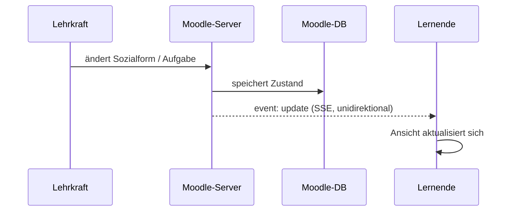
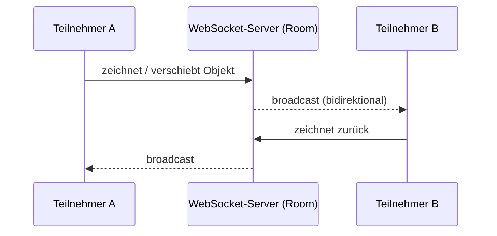

# 2 · Realtime-Architektur

## Entscheidung: Realtime über SSE, WebSocket nur fürs Board
*Status: akzeptiert (2026-06-24)*

- **WebSocket** (Excalidraw-Room): einziges Tool mit **bidirektionaler** Verbindung → das **Board**.
- **SSE** (Server-Sent Events): **alle anderen** Tools (Gruppentool, KI-Chatbot, Abfrage, Bewertung).
- **Polling**: getestet und verworfen — bei 30+ Lernenden erzeugt jeder Client sekundündliche Anfragen; Serverlast skaliert linear mit Teilnehmerzahl, Latenz bleibt fix auf Intervall-Länge.
- **WebRTC**: getestet und verworfen — Peer-to-Peer umgeht den Schulserver (kein DSGVO-konformer Datenpfad), erfordert externen STUN/TURN-Betrieb und wird in Schulnetzen häufig durch Firewalls blockiert.

**Konsequenzen:** einfacher Betrieb und geringe Last (nur ein Tool braucht einen WS-Server),
DSGVO-freundlich — aber zwei Realtime-Mechanismen im Code, und das Board benötigt seinen
eigenen WebSocket-Server.

## Prototypen aus den Experimenten
Die Entscheidung beruht auf eigenen Tests — die Aufzeichnungen belegen das jeweilige Verhalten:

**Polling & WebRTC (verworfen):**

> *📎 Diagramm/Medium „webrtc_polling.mp4" — lokal in Obsidian verfügbar, nicht in Git.*

**SSE (gewählt):**

> *📎 Diagramm/Medium „SSE_test.mp4" — lokal in Obsidian verfügbar, nicht in Git.*

## SSE-Fluss (Standard für die meisten Tools)

## WebSocket-Fluss (nur Board)

## Faustregel für neue Tools
- Reicht **Server → Client**? → **SSE**.
- Echtes gemeinsames Editieren mit **Client ↔ Client**? → **WebSocket**.

> Wo die Daten liegen und wie betrieben wird: [3 · Daten & Betrieb](03-daten-betrieb.md).
