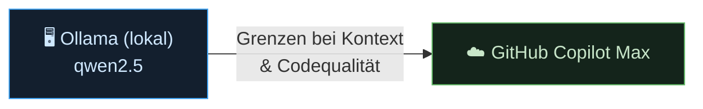

# 4 · Vorgehensweise (Entwicklungsmethodik)

Wie ist diese Suite entstanden? Drei Prinzipien tragen die Arbeit: **Dokumentation zuerst**,
**iteratives Prototyping** und **KI-gestützte Entwicklung**. Sie erklären, warum die
Entscheidungen so getroffen wurden — nicht nur *was* gebaut wird, sondern *wie*.

> Diese Seite beschreibt den **Entwicklungsprozess** (mein Werkzeugkasten beim Bauen).
> Sie ist **nicht** zu verwechseln mit dem **KI-Dienst im Plugin** — dem austauschbaren,
> DSGVO-geprüften Chatbot-Provider (Ollama / Fobizz / HAWKI), siehe
> [KI-Chatbot](../03-werkzeuge/02-chatbot.md).

---

## 1 · Dokumentation zuerst

Diese Dokumentation ist die **einzige Quelle der Wahrheit** — Worte in Markdown, Diagramme
inline als Mermaid. Erst wird die Idee in Text und Diagramm geschärft, dann implementiert. Das hat
zwei Gründe: Die Planung bleibt verständlich für die **Uni-Präsentation**, und sie dient
gleichzeitig als **Kontext für die KI** bei der Umsetzung. Beide Zielgruppen lesen dasselbe.

---

## 2 · KI-gestützte Entwicklung

Die Suite wurde durchgehend mit KI-Assistenz entwickelt. Der Weg dahin war ein **Lernprozess
über mehrere Modelle** — von lokal/self-hosted bis zur Cloud:

| Phase | Werkzeug | Erfahrung |
|---|---|---|
| Erste Experimente | **Ollama** mit **qwen2.5** (self-hosted) | Volle Datenkontrolle, keine Kosten — aber begrenzte Kontextgröße und Codequalität bei einer mehrteiligen Moodle-Plugin-Suite. |
| Aktueller Stand | **GitHub Copilot Max** | Größerer Kontext, bessere Codequalität und Werkzeug-Integration (Repo-Wissen, Mehrschritt-Aufgaben) — passt zum Umfang dieses Projekts. |

> Die lokalen Versuche (Ollama/qwen2.5) waren zugleich der Anstoß, **self-hosted KI** auch als
> realistische Option für den **Plugin-Chatbot** mitzudenken — getrennt vom Dev-Workflow, aber
> aus derselben Erfahrung gespeist.

---

## 3 · Iteratives Prototyping (Realtime)

Die Realtime-Schicht wurde **experimentell** erarbeitet, nicht am Reißbrett. Mehrere Ansätze
wurden gebaut, gemessen und teils wieder verworfen:

- **Polling** — getestet, verworfen (Last skaliert mit Teilnehmerzahl).
- **WebRTC** — getestet, verworfen (Peer-to-Peer umgeht den Schulserver, kein DSGVO-konformer Datenpfad, Firewall-Probleme).
- **SSE** — gewählt für die meisten Tools; **WebSocket** nur fürs Board.

Die Aufzeichnungen dieser Versuche (Polling/WebRTC, SSE sowie das Gruppentool in der Praxis)
belegen die Entscheidung und sind als Prototyp-Videos dokumentiert:

> Belege & Herleitung: [Realtime-Architektur → Prototypen](02-realtime.md#prototypen-aus-den-experimenten).

---

## Was sich bewährt hat

- **Erst dokumentieren, dann bauen** — die KI liefert bessere Ergebnisse mit klarem Kontext.
- **Prototypen schlagen Annahmen** — die Realtime-Entscheidung steht auf gemessenem Verhalten.
- **Werkzeug an Aufgabe anpassen** — lokal für Datenschutz-Tests, Copilot Max für den produktiven Bau.
