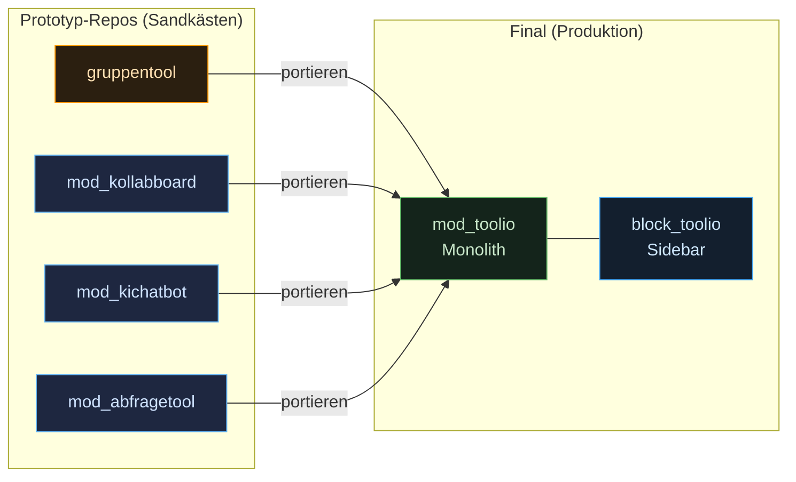

# 1 · Repos & Zusammenführung

Wie ist die Entwicklung **organisiert** — welche Repositories gibt es, wer baut was,
und wie entsteht daraus am Ende **ein** installierbares Produkt? Dieses Kapitel
beschreibt den **Bau-Prozess**, nicht das Produkt (das steht in [`03-werkzeuge/`](../03-werkzeuge/)).

> Werkzeug-spezifische Betriebs-Details stehen in eigenen Kapiteln, z. B.
> [3 · Board-Deployment](03-board-deployment.md).

## Grundprinzip: final nur zwei Plugins

Auf einer produktiven Moodle-Instanz müssen am Ende **nur zwei Plugins** installiert werden:

| Plugin | Rolle |
|---|---|
| **`mod_toolio`** | **Monolith** — enthält **alle** Werkzeuge intern (Gruppentool, Chatbot, Board, Abfrage, Bewertung) und den Live-Unterricht-Orchestrator |
| **`block_toolio`** | **Sidebar** — Navigations- und Steuer-Element im Kurs |

> Alle anderen Repos (siehe unten) sind **Prototyp-Sandkästen** und werden **nicht**
> auf Produktion installiert. Ihre Funktionalität wird in `mod_toolio` **portiert**.

## Warum Prototypen?

Das Team besteht aus **vier Personen** mit unterschiedlicher Coding-Erfahrung. Damit
alle beitragen können, gilt die Arbeitsteilung:

1. Jedes Teammitglied baut einen **funktionierenden Prototyp** seines Werkzeugs in
   einem **eigenen Repo** — Hauptsache, die Funktion ist sichtbar und bedienbar.
2. **Michele** überträgt („portiert") die Funktionalität dann in das finale
   `mod_toolio` und bringt sie auf den gemeinsamen Struktur- und Qualitätsstand
   (Namensgebung, drei Ansichten, gemeinsamer Realtime-Kanal).



## Werkzeug → Repo → Ziel-Slot

| Werkzeug | Spec | Prototyp-Repo | Ziel in `mod_toolio` | Zuständig | Status |
|---|---|---|---|---|---|
| **Gruppentool** | [Spec](../03-werkzeuge/01-gruppentool.md) | `local-plugins/gruppentool` (extern, alt) | `tools/gruppentool/` | Michele | Prototyp fertig (SSE, AJAX) |
| **KI-Chatbot** | [Spec](../03-werkzeuge/02-chatbot.md) | `mod_kichatbot` | `tools/chatbot/` | Teammitglied | HTML-Prototyp, Portierung nötig |
| **Board** | [Spec](../03-werkzeuge/03-board.md) | `mod_kollabboard` | `tools/board/` | Teammitglied | Stub, WebSocket offen |
| **Abfrage** | [Spec](../03-werkzeuge/04-abfrage.md) | `mod_abfragetool` | `tools/abfrage/` | Teammitglied | Skelett, Prototyp ausstehend |
| **Bewertung** | [Spec](../03-werkzeuge/05-bewertung.md) | `mod_bewertung` *(Platzhalter)* | `tools/bewertung/` *(Reserve)* | — | **Reserve** — nur falls Zeit übrig |

> **Bewertungstool = Reserve.** Es ist als Puffer gedacht, falls in der Entwicklung
> Zeit bleibt. Das Repo `mod_bewertung` existiert bereits als **valider Platzhalter**
> (Skelett wie `mod_abfragetool`), damit es die Deploy-Pipeline nicht blockiert; die
> eigentliche Funktion wird erst bei Bedarf gebaut. In `mod_toolio` wird nur ein
> **Platzhalter-Slot** vorgehalten (siehe [interne Struktur](02-mod-toolio-struktur.md)).

> **Board-Sync:** Änderungen am Board entstehen zuerst im Prototyp `mod_kollabboard`
> und werden von dort **wiederholt** nach `tools/board/` in `mod_toolio` übernommen —
> das Board bleibt also dauerhaft im eigenen Repo pflegbar und fließt regelmäßig in Toolio.

## Deploy-Pipeline

Jedes Plugin-Repo ist mit GitHub verbunden und deployt automatisch auf den Staging-Server:

```
git push (main) → GitHub Actions → rsync → /opt/toolio/staging/{plugin}/ → deploy.sh → upgrade.php
```

- `upgrade.php` scannt **alle** installierten Plugins — **ein defektes Plugin blockiert
  alle Upgrades**. Daher gelten die [Moodle-Coding-Guidelines](../../.github/copilot-instructions.md)
  (korrekte Sprachdatei-Benennung, `db/install.xml`, kein `mod_`-Präfix an falscher Stelle).
- Prototyp-Repos deployen auf Staging zum **Testen**, nicht auf Produktion.

## Was jedes Prototyp-Repo mindestens liefern soll

Damit die Portierung reibungslos läuft, sollte ein Prototyp:

1. **funktionieren** — die Kernfunktion ist sichtbar und bedienbar,
2. die **drei Ansichten** wenigstens andeuten (Schüler · LK-ON · LK-OFF) —
   fehlen welche, füllt Michele sie beim Portieren,
3. **Realtime über SSE** nutzen (Ausnahme: Board → WebSocket),
   siehe [Realtime-Architektur](../02-architektur/02-realtime.md),
4. seinen **Zustand in der Moodle-DB** halten (`db/install.xml`), keine Fremd-Datenbank.

> Wie die Werkzeuge intern in `mod_toolio` einsortiert werden:
> [2 · Interne Struktur von `mod_toolio`](02-mod-toolio-struktur.md).
