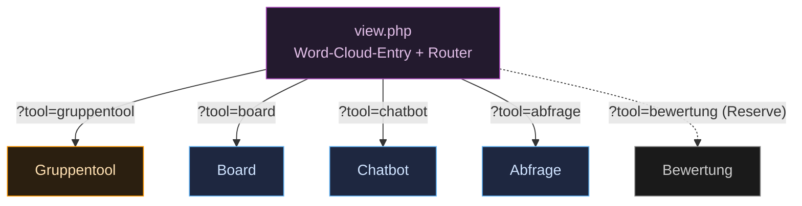
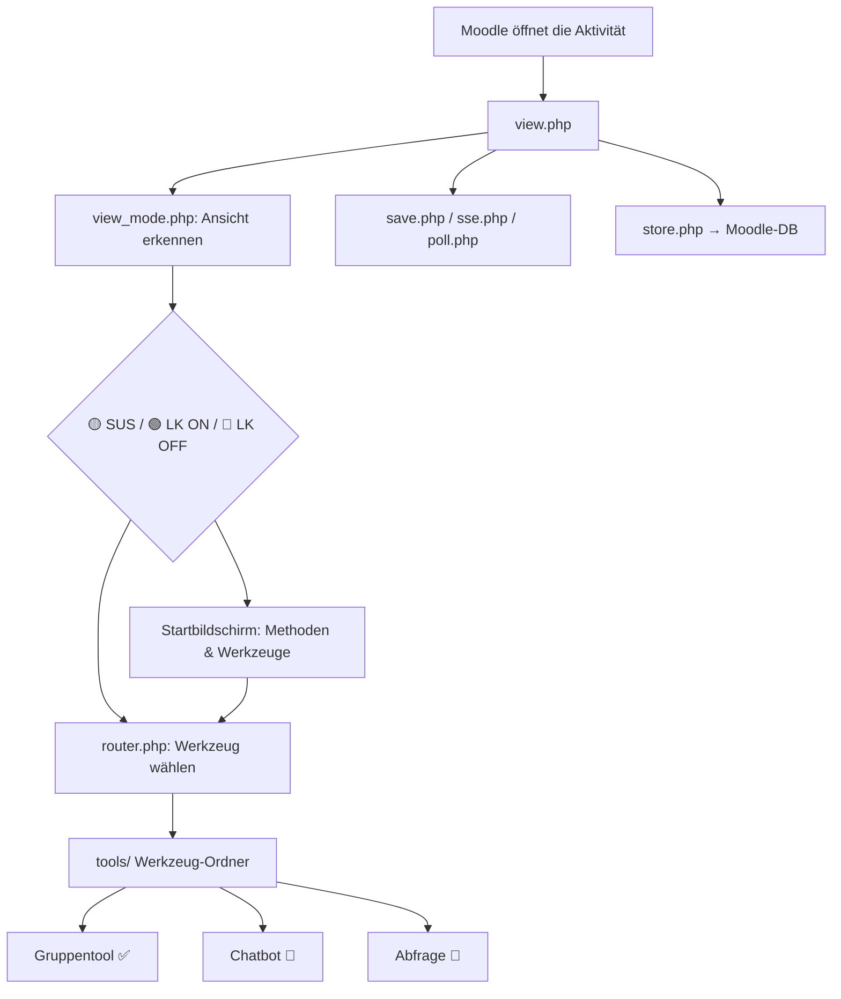

# 2 · Interne Struktur von `mod_toolio`

`mod_toolio` ist ein **Monolith**: Alle Werkzeuge leben **innerhalb** dieses einen
Aktivitätsplugins. Damit das Portieren von fünf Prototypen kein Chaos erzeugt, legt
dieses Kapitel die **Ziel-Struktur** fest — die Orientierung, an der sich jede
Portierung ausrichtet.

> **Status:** Design-Vorgabe (noch nicht vollständig umgesetzt). Der heutige Stand ist
> eine flache Word-Cloud in `view.php`; die hier beschriebene Struktur ist das Ziel.

## Leitidee: Entry → Router → Werkzeug

`view.php` bleibt der **Einstieg** (die Word-Cloud der didaktischen Methoden) und wird
zusätzlich zum **Router**: Ein Klick auf eine Methode öffnet das zugehörige Werkzeug
als **Sub-Ansicht derselben Aktivität** — kein separates Plugin, kein neuer Link.



Die Rolle-/Modus-Erkennung (Schüler · LK-ON · LK-OFF) passiert **einmal zentral** im
Router und wird an das Werkzeug durchgereicht — jedes Werkzeug rendert dann seine
passende der drei Ansichten.

## Ziel-Verzeichnislayout

```
mod_toolio/
├── view.php              # Entry (Word-Cloud) + Router: wählt Werkzeug & Ansicht
├── lib.php               # Moodle-Hooks (toolio_add_instance, ...)
├── mod_form.php          # Aktivitäts-Formular
├── sse.php               # GEMEINSAMER Realtime-Kanal (Server → Client) für alle SSE-Tools
├── ajax.php              # GEMEINSAMER Schreib-Endpoint (Client → Server)
├── create.php · delete.php · rename.php   # bestehende Verwaltungs-Endpoints
├── classes/
│   ├── router.php        # Werkzeug- & Ansichtsauswahl
│   ├── view_mode.php     # Schüler | lk_on | lk_off (zentrale Ermittlung)
│   └── tool/             # gemeinsame Basis / Interface je Werkzeug
├── tools/
│   ├── gruppentool/      # je Werkzeug: render + tool-spezifische Logik
│   ├── board/            #   (Board zusätzlich mit WebSocket-Anbindung)
│   ├── chatbot/
│   ├── abfrage/
│   └── bewertung/        # RESERVE — Platzhalter-Slot, leer bis Bedarf
├── templates/            # Mustache-Templates je Ansicht
├── amd/                  # JS (Build/Src) — z. B. SSE-Client, Word-Cloud
├── db/                   # install.xml, access.php, services.php
├── lang/en/toolio.php    # eine Sprachdatei für den gesamten Monolith
└── version.php
```

## Gemeinsame Bausteine (nur einmal, nicht je Werkzeug)

| Baustein | Datei | Warum gemeinsam |
|---|---|---|
| **Realtime lesen** | `sse.php` | Ein SSE-Endpoint bedient alle Werkzeuge (außer Board-WS). Weniger Verbindungen, ein Codepfad. |
| **Realtime schreiben** | `ajax.php` | Ein Schreib-Endpoint; das Werkzeug wird per Parameter adressiert. |
| **Rolle/Modus** | `classes/view_mode.php` | Schüler/LK-ON/LK-OFF wird **einmal** ermittelt und durchgereicht. |
| **Sprache** | `lang/en/toolio.php` | **Eine** Sprachdatei für den ganzen Monolith (Moodle-Konvention `mod_` → `toolio.php`). |
| **DB** | `db/install.xml` | Alle Werkzeug-Tabellen in **einem** Schema; Präfixe je Werkzeug (`toolio_board_...`). |

> **Board-Ausnahme:** Das Board nutzt statt `sse.php` einen separaten
> **WebSocket-Server** (Excalidraw-Room). Es lebt zwar auch unter `tools/board/`,
> hat aber seinen eigenen Realtime-Pfad — siehe
> [Realtime-Architektur](../02-architektur/02-realtime.md).

## Verbindliche Regeln beim Portieren

1. **Ein Werkzeug = ein Ordner** unter `tools/`. Keine Werkzeug-Logik in `view.php`.
2. **Drei Ansichten** je Werkzeug (Schüler · LK-ON · LK-OFF) — die zentrale
   Modus-Ermittlung nutzen, nicht je Werkzeug neu erfinden.
3. **DB-Tabellen mit Werkzeug-Präfix**: `toolio_gruppentool_*`, `toolio_board_*` usw.,
   damit im gemeinsamen Schema nichts kollidiert.
4. **Realtime über den gemeinsamen `sse.php`** (Board ausgenommen).
5. **Sprachstrings** in die zentrale `lang/en/toolio.php`, thematisch gruppiert.
6. **Kein `mod_`-Präfix** in Hook-Funktionsnamen und Moodle-API-Aufrufen
   (Short Name `toolio`) — siehe [Coding-Guidelines](../../.github/copilot-instructions.md).

## Bewertung als Reserve-Slot

Der Ordner `tools/bewertung/` wird als **leerer Platzhalter** vorgehalten. Solange das
Werkzeug nicht gebaut wird, taucht es **nicht** in der Word-Cloud-Route auf. Wird Zeit
frei, folgt es exakt denselben Regeln wie die anderen Werkzeuge — die
[Spec](../03-werkzeuge/05-bewertung.md) liegt bereits vollständig vor.

> Woher die einzelnen Werkzeug-Funktionen kommen und wer sie baut:
> [1 · Repos & Zusammenführung](01-repos-und-zusammenfuehrung.md).

---

## Aktueller Ist-Stand (Stand August 2026)

> **Hinweis:** Dieser Abschnitt beschreibt den tatsächlichen Bauzustand des Plugins —
> nicht das Zielbild oben. Beides gehört zusammen: Das Zielbild gibt die Richtung,
> der Ist-Stand zeigt, wie weit der Weg schon gegangen ist.

### Was bereits gebaut ist

| Bereich | Datei / Ordner | Status |
|---|---|---|
| Moodle-Einstieg | `view.php`, `lib.php`, `mod_form.php`, `version.php` | ✅ vollständig |
| Ansichtserkennung | `classes/view_mode.php` | ✅ vollständig |
| Router | `classes/router.php` | ✅ vollständig (Abfrage noch `ready:false`) |
| Gemeinsamer State-Zugang | `classes/store.php` | ✅ vollständig |
| UI-Bausteine | `classes/ui.php` | ✅ vollständig |
| Board-Raumlogik | `classes/board.php` | ✅ vollständig |
| Datenbank-Rückgrat | `db/install.xml`, `db/upgrade.php` | ✅ vollständig (ADR-0003) |
| Sprachdatei | `lang/en/toolio.php` | ✅ vollständig |
| Rechte | `db/access.php` | ✅ vollständig |
| Gruppentool | `tools/gruppentool/` | ✅ vollständig portiert |
| Board-Speicher | `tools/board/storage.php` | ✅ eingebunden |
| Realtime (SSE) | `sse.php`, `poll.php` | ✅ funktionsfähig |
| Schreib-Endpoint | `save.php` | ✅ inkl. `tool=abfrage` und `tool=timer/frozen/gruppen` |
| Verwaltungs-Endpoints | `create.php`, `delete.php`, `rename.php` | ✅ vollständig |
| Admin-Einstellungen | `settings.php` | ✅ vollständig |
| **5-Schritt-Navigation (LK ON)** | `view.php` → `buildCreateFooter()` | ✅ immer sichtbare Kreiskette: Methoden · Material · Werkzeug · Sozialform · Einstellungen |
| **Abfrage-Editor (LK ON Schritt 4)** | `view.php` → `buildAbfrageEditor()` | ✅ MS-Forms-Kartenstil; Typen: Auswahl / Freitext / Bewertung / Skala; Viz-Auswahl, Pflicht-Toggle, AJAX-Speichern via `tool=abfrage` |
| **Abfrage-Moderationsansicht (LK OFF)** | `view.php` → `buildAbfrageLkOff()` | ✅ zeigt konfigurierte Fragen read-only |
| **Abfrage-Teilnehmerformular (SuS)** | `view.php` → `buildAbfrageSus()` | ✅ Fragenformular (Abschicken via localStorage, kein Backend noch) |
| **JSON-Debug-Panel** | `view.php` (unter dem 4:3-Rahmen) | ✅ zeigt live den vollständigen Toolio-State (materials, tool, sozialform, groups live via `boardGroups()`, abfrage); alle drei Views |
| KI-Chatbot | `tools/chatbot/` | 🔲 ausstehend |
| Abfrage (Router-Pfad) | `tools/abfrage/render.php` | 🔲 JS-seitig fertig, PHP-Router-Pfad ausstehend |
| Bewertung | `tools/bewertung/` | 🔲 Reserve-Slot |
| Gemeinsamer `ajax.php` | _(noch nicht vorhanden)_ | 🔲 Zielbild noch nicht erreicht |
| `templates/` | _(noch nicht vorhanden)_ | 🔲 Zielbild noch nicht erreicht |
| `amd/` | _(noch nicht vorhanden)_ | 🔲 Zielbild noch nicht erreicht |

### Abfrage-Datenfluss (aktuell)

Der Abfrage-State lebt als `abfrage`-Schlüssel **innerhalb** des bestehenden
`toolio_gruppentool_state`-Blobs (ADR-0003). Kein eigenes Schema nötig.

```
LK ON Schritt 4  →  abfrageState (JS)  →  save.php?tool=abfrage
                                                ↓
                                    toolio_gruppentool_state.payload
                                    { ..., "abfrage": { title, questions[] } }

LK OFF / SuS     →  BOOT.state.abfrage  →  buildAbfrageLkOff() / buildAbfrageSus()
```

`save.php?tool=gruppen` (Freigabe via "Starten") bewahrt den `abfrage`-Key aus dem
vorherigen DB-Stand — er wird nie durch den Gruppen-Save überschrieben.

### Besonderheit: view.php als JS-Monolith

`view.php` hat sich zu einer ~2400 Zeilen großen PHP+JS+CSS-Datei entwickelt.
Das ist pragmatisch richtig für die aktuelle Phase, sollte aber mittelfristig
aufgeteilt werden:

| Vorgeschlagener Schritt | Ziel |
|---|---|
| CSS → `assets/view.css` | Externe Datei, kein PHP-Mix mehr |
| Abfrage-JS → `view_abfrage_js.php` | Per PHP `include()` eingebettet, gleicher JS-Scope |
| GT-Board-JS → `view_gt_js.php` | Gleiches Prinzip |

Dieser Schritt ist nicht kritisch für den laufenden Betrieb — das Zielbild-Layout
oben bleibt die langfristige Referenz.

### Wie das Plugin beim Öffnen funktioniert (Ablauf)

1. Moodle ruft `view.php` auf — das ist der einzige Einstiegspunkt für Nutzer.
2. `view_mode.php` entscheidet die Ansicht: 🟡 Schüler, 🟢 LK ON oder 🔵 LK OFF.
3. `view.php` baut den Startbildschirm (Methoden-Globus / Werkzeugauswahl).
4. Klick auf ein Werkzeug → `router.php` übernimmt und wählt das richtige Tool.
5. Das Werkzeug wird aus `tools/<name>/render.php` gerendert.
6. Speichern läuft über `save.php` → `store.php` → Moodle-DB.
7. Live-Updates kommen über `sse.php` (Push) oder `poll.php` (Fallback).
8. Das Board hat zusätzlich einen externen WebSocket-Server für Echtzeit-Kollaboration.



### Dateien auf einen Blick

| Kategorie | Dateien | Aufgabe |
|---|---|---|
| **Einstieg** | `view.php` | Alles beginnt hier |
| **Gemeinsame Logik** | `classes/` | Router, Ansicht, State, UI, Board |
| **Werkzeuge** | `tools/` | Jedes Werkzeug in eigenem Ordner |
| **Daten** | `db/`, `classes/store.php` | Schema und Datenzugriff |
| **Realtime & Speichern** | `save.php`, `sse.php`, `poll.php` | Live-Updates und Persistenz |
