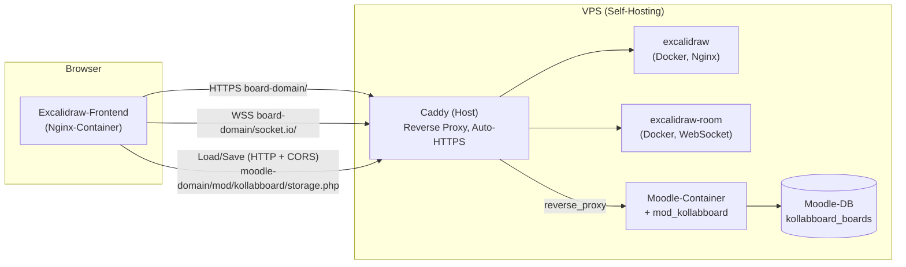

# 3 · Board-Deployment (Excalidraw ohne Firebase)

Wie das **kollaborative Board** technisch betrieben wird. Dieses Kapitel gehört zur
**Bau-Ebene** — es beschreibt die Server-Dienste und die Anbindung an Moodle, nicht die
Didaktik (die steht in [`03-werkzeuge/03-board.md`](../03-werkzeuge/03-board.md)).

## Grundsatzentscheidung: nur EIN echter Dienst
*Status: akzeptiert (2026-07-28)*

Das Vorbild [kitsteam/excalidraw](https://github.com/kitsteam/excalidraw) (Fork **ohne
Firebase**) besteht aus **drei** Diensten. Für Toolio brauchen wir davon nur **einen**,
weil **Moodle die Persistenz übernimmt**:

| kitsteam-Dienst | Aufgabe | Bei Toolio? |
|---|---|---|
| `excalidraw` (Frontend) | React-Zeichenfläche | **statischer Build**, von Nginx ausgeliefert — kein „Dienst" |
| `excalidraw-room` (WebSocket) | Live-Sync zwischen Clients (socket.io, stateless) | **ja — der einzige echte Docker-Dienst** |
| `excalidraw-storage-backend` + PostgreSQL | flüchtiger Zwischenspeicher (Firebase-Ersatz) | **nein — ersetzt durch Moodle-DB** |

**Begründung:** In einem Kurs kann es **mehrere Boards** geben (mehrere
`mod_kollabboard`-Instanzen). Nur Moodle kennt `cmid`, `groupid` und Kurskontext — ein
globaler Zwischenspeicher wäre die falsche Ebene. Weniger Dienste = weniger Angriffsfläche,
weniger DSGVO-Fragen (kein zweiter Datenspeicher), weniger Betriebsaufwand.

**Kompromiss:** Ohne Zwischenspeicher geht der Board-Zustand verloren, wenn **alle**
Teilnehmer den Tab schließen, **bevor** gespeichert wurde. Gelöst durch **Autosave
(~10 s)** nach Moodle plus expliziten Speichern-Button.

## Topologie

Das Frontend läuft auf einer **eigenen Subdomain** (Root-Pfad), der Room-Server wird auf
derselben Subdomain unter `/socket.io/` veröffentlicht. Grund: die kitsteam-Fork setzt
**kein Vite-`base`** und geht durchgehend von Root-Pfaden aus — Betrieb unter einem
Unterpfad würde ein Patchen der Fork erfordern (fragil bei Updates). Die spätere
Einbettung ins Toolio-Plugin erfolgt per **iframe**, dessen `src` beliebig ist — die
Subdomain ist damit **keine** Sackgasse.



## Raum- und Persistenz-Modell

Mehrere Boards je Kurs werden über die **Raum-ID** und den **DB-Schlüssel** sauber getrennt:

```
Kurs
 ├─ Board A (cmid=101)
 │   ├─ Gruppe 1 → Raum "kb-101-g1"     → DB (cmid=101, groupid=1)
 │   ├─ Gruppe 2 → Raum "kb-101-g2"     → DB (cmid=101, groupid=2)
 │   └─ Tafelbild → Raum "kb-101-shared"
 └─ Board B (cmid=102)
     └─ Gruppe 1 → Raum "kb-102-g1"     → DB (cmid=102, groupid=1)
```

- **`excalidraw-room`** trennt Live-Sessions über die Raum-ID — ein Container bedient
  beliebig viele Räume, stateless.
- **Moodle-DB** hält eine Zeile je `(cmid, groupid)` → beliebig viele Boards × Gruppen
  sind eindeutig adressierbar.

### Tabelle `kollabboard_boards`
Eine Zeile je Raum. Gespeichert wird **nur der E2E-verschlüsselte Blob** (base64), nie Klartext.

| Feld | Zweck |
|---|---|
| `id` | Primärschlüssel |
| `roomid` | unerratbare Raum-ID (HMAC-abgeleitet), UNIQUE |
| `kollabboardid` | Board-Instanz (FK auf `kollabboard.id`) |
| `groupid` | Gruppe (0 = gemeinsames Tafelbild) |
| `sceneversion` | Excalidraw-Szenenversion (aus den ersten 4 Bytes des Blobs) |
| `sceneblob` | base64 des verschlüsselten Szenen-Blobs `[4B ver][12B IV][ciphertext]` |
| `savedby` | Moodle-User-ID des letzten Speicherns (0 = unbekannt) |
| `timecreated` / `timemodified` | Zeitstempel |

### Tabelle `kollabboard_files`
Eingefügte Bilder — ebenfalls nur verschlüsselte Blobs.

| Feld | Zweck |
|---|---|
| `id` | Primärschlüssel |
| `roomid` | Raum-ID (Teil des UNIQUE-Index `roomid, fileid`) |
| `fileid` | Datei-ID von Excalidraw |
| `filedata` | base64 des verschlüsselten Datei-Blobs |
| `timecreated` / `timemodified` | Zeitstempel |

## Datenfluss

Das Board spricht Moodle über den **HTTP-Storage-Vertrag der kitsteam-Fork** an
(`storage.php` bildet ihn nach). Alle Blobs sind client-seitig E2E-verschlüsselt.

```
Board öffnen  → view.php leitet in den iframe: /app?username=<name>#room=<roomid>,<roomkey>
Beitritt      → Browser GET storage.php/api/v2/rooms/<roomid>
                 · 404 (leerer/neuer Raum) → Client startet mit leerer Szene
                 · 200 Blob → Client entschlüsselt lokal (Schlüssel aus URL-Fragment)
Session       → excalidraw-room synct live zwischen den Clients (WebSocket)
Autosave      → Browser PUT storage.php/api/v2/rooms/<roomid>  (verschlüsselter Blob)
Bilder        → GET/PUT storage.php/api/v2/files/rooms/<roomid>/<fileid>
```

## Schritt-für-Schritt: Board-Server aufsetzen

Diese Abfolge richtet den Board-Server **von Null** ein — bewusst auch für Einsteiger
geschrieben. `<board-domain>` / `<moodle-domain>` durch die echten Domains ersetzen;
Beispielpfad (`/opt/board`) und Host-Ports (`5001`/`5002`) sind frei wählbar. **Echte
Domains, IPs und Container-Namen gehören in private Betriebsnotizen**, nicht in diese Doku.

**Voraussetzungen**
- Ein Server mit **Docker** + `docker compose` (darf derselbe Host wie Moodle sein).
- Ein **Reverse Proxy** mit automatischem HTTPS — empfohlen **Caddy** (macht TLS **und**
  WebSocket-Upgrade von selbst); Nginx geht auch (Schritt 5).
- **Zwei DNS-Namen** auf den Server zeigend: `<moodle-domain>` (Moodle) und `<board-domain>`
  (Board — eigene Subdomain, da die Fork von Root-Pfaden ausgeht).
- Auf kleinen Servern (≤ 4 GB RAM) vorab ein **Swapfile** anlegen, sonst bricht der
  Frontend-Build mit „out of memory" ab.

### Schritt 1 — Arbeitsordner + Fork holen
```bash
sudo mkdir -p /opt/board && cd /opt/board
git clone --depth 1 https://github.com/kitsteam/excalidraw.git excalidraw
```

### Schritt 2 — Fork patchen + `.env.production` schreiben
Die Fork ist für Standalone-Betrieb gebaut. Für iframe-Einbettung mit Live-Collab, saubere
leere Räume und Moodle-Namen sind **vier** kleine Quellcode-Änderungen plus die
Build-Variablen nötig. Das **idempotente Skript** erledigt beides in einem Befehl:
```bash
BOARD_DOMAIN=<board-domain> MOODLE_DOMAIN=<moodle-domain> \
  python3 scripts/patch-excalidraw-fork.py --path /opt/board/excalidraw
```
> Welche vier Stellen genau geändert werden (Diffs) und wie `.env.production` aussieht,
> steht unten unter [Serverseitige Fork-Anpassungen](#serverseitige-fork-anpassungen-reproduzierbar).
> Ohne Skript die vier Diffs dort von Hand anwenden und `.env.production` selbst schreiben.

### Schritt 3 — `docker-compose.yml` anlegen
`/opt/board/docker-compose.yml` — beide Dienste nur an **localhost** binden (nach außen geht
ausschließlich der Reverse Proxy):
```yaml
services:
  excalidraw-room:
    build:
      context: https://github.com/kitsteam/excalidraw-room.git#master
    container_name: excalidraw-room
    restart: always
    ports:
      - "127.0.0.1:5001:8090"   # WebSocket-Room, nur intern

  excalidraw:
    build:
      context: ./excalidraw
      target: production
    container_name: excalidraw
    restart: always
    environment:
      - NGINX_PORT=3000
    ports:
      - "127.0.0.1:5002:3000"   # Frontend, nur intern
```

### Schritt 4 — Bauen und starten
```bash
cd /opt/board
docker compose up -d --build
# interner Selbsttest auf dem Host:
curl -I http://127.0.0.1:5002/            # Frontend      → 200
curl -I http://127.0.0.1:5001/socket.io/  # Room-Server    → antwortet (200/400)
```
> Env oder Fork später geändert? Nur das Frontend neu bauen:
> `docker compose up -d --build excalidraw`.

### Schritt 5 — Reverse Proxy inkl. WebSocket (der kritische Teil)
Der Proxy veröffentlicht auf `<board-domain>` **zwei** Dinge: den HTTP-Verkehr → Frontend
**und** `/socket.io/` → Room-Server (WebSocket). Wird die WebSocket-Route vergessen, **lädt
das Board zwar, synchronisiert aber nichts**.

**Caddy (empfohlen)** — erkennt WebSocket-Upgrades automatisch, keine Extra-Header:
```caddy
<board-domain> {
    handle /socket.io/* {        # MUSS vor dem allgemeinen handle stehen
        reverse_proxy 127.0.0.1:5001
    }
    handle {
        reverse_proxy 127.0.0.1:5002
    }
}

<moodle-domain> {
    reverse_proxy 127.0.0.1:<moodle-port>
}
```
Neu laden: `caddy reload --config /etc/caddy/Caddyfile`

**Nginx (Alternative)** — Upgrade-Header **manuell** setzen (häufigste Fehlerquelle):
```nginx
location /socket.io/ {
    proxy_pass http://127.0.0.1:5001;
    proxy_http_version 1.1;
    proxy_set_header Upgrade $http_upgrade;     # Pflicht für WebSocket
    proxy_set_header Connection "upgrade";      # Pflicht für WebSocket
    proxy_set_header Host $host;
    proxy_read_timeout 86400;                   # lange Verbindungen offen halten
}
location / {
    proxy_pass http://127.0.0.1:5002;
    proxy_set_header Host $host;
}
```

### Schritt 6 — Verifizieren
```bash
# Handshake muss 101 (Switching Protocols) oder 200 liefern, NICHT 404/502:
curl -I "https://<board-domain>/socket.io/?EIO=4&transport=polling"
```
Praxistest: `https://<board-domain>/` öffnet die Zeichenfläche. Denselben Raum in **zwei**
Browser-Tabs öffnen → Zeichnen im einen erscheint **sofort** im anderen. Passiert nichts →
`/socket.io/`-Route im Proxy prüfen.

### Schritt 7 — Mit Moodle verbinden
Im Board-Plugin `mod_kollabboard` die **Board-URL** setzen — sie bestimmt die iframe-Quelle
**und** die erlaubte CORS-Origin des Storage-Endpoints `storage.php`:
```bash
php <moodle>/admin/cli/cfg.php \
  --component=mod_kollabboard --name=boardurl --set=https://<board-domain>
```
(oder per Oberfläche: Website-Administration → Plugins → Aktivitäten → **KollabBoard** →
Feld **Board-URL**). Die Tabellen `kollabboard_boards`/`kollabboard_files` legt Moodle beim
Plugin-Upgrade automatisch an. Fertig — eine **KollabBoard**-Aktivität im Kurs zeigt jetzt
das eingebettete, live-synchronisierte Board.

---

## Präzisierung: Live-Collab ist Kernanforderung — Moodle spielt den Storage-Backend
*Status: akzeptiert (2026-07-28)*

**Live-Kollaboration ist der eigentliche Zweck des Boards** und damit **Pflicht ab v1**.
Deshalb bleiben wir bewusst beim **kitsteam-Fork** (fertiges, E2E-verschlüsseltes
Echtzeit-Sync via `excalidraw-room`) statt die npm-Komponente zu nehmen — dort müsste der
Collab-Layer aufwändig neu gebaut werden. Excalidraw wurde gewählt, weil aufgeräumt,
optisch gut und MIT-lizenziert.

**Erkenntnis beim ersten Live-Test:** Der Raum-**Beitritt** der Fork hängt am
Storage-Backend (`loadFromStorageBackend`) — u. a. damit **Nachzügler** den aktuellen Stand
laden. Ohne diesen Dienst fällt die Fork auf **Firebase** zurück (leer konfiguriert) →
`OperationError` → „forcing reload"-Schleife → Crash-Screen. Der Storage-Backend ist also
**nicht** optional, wenn Live-Collab robust sein soll.

**Auflösung (bestätigt die Grundsatzentscheidung, statt sie zu verwerfen):**
> **Ein Moodle-Endpoint übernimmt die Rolle des Storage-Backends.** Excalidraw
> verschlüsselt die Szene **client-seitig Ende-zu-Ende** (der Raum-Schlüssel verlässt den
> Browser nie). Moodle speichert damit **nur Chiffretext** → DSGVO-sauber, kein zweiter
> Klartext-Datenspeicher. Ein Ziel-Endpoint liefert **Persistenz *und* Nachzügler-Sync**.
> Umsetzung: `VITE_APP_STORAGE_BACKEND=http` + `VITE_APP_HTTP_STORAGE_BACKEND_URL` auf den
> Moodle-Endpoint `storage.php` zeigen (HTTP-Vertrag der kitsteam-Fork nachgebildet),
> Blobs in `kollabboard_boards`/`kollabboard_files`.

### Serverseitige Fork-Anpassungen (reproduzierbar)
*Status: umgesetzt (2026-07-28)*

Die kitsteam-Fork wird an **vier** Stellen gepatcht und **neu gebaut**. Genau diese
Patches braucht man auch für den lokalen Docker-Nachbau (Platzhalter unten ersetzen).

**1. Live-Collab im iframe zulassen** — `excalidraw-app/App.tsx`
```diff
- const isCollabDisabled = isRunningInIframe();
+ const isCollabDisabled = false;
```

**2. „I'm not a pretzel!"-Guard entschärfen** — `excalidraw-app/App.tsx`
```diff
-     if (parentUrl.origin === currentUrl.origin) {
+     if (false && parentUrl.origin === currentUrl.origin) {
```

**3. Leerer Raum darf nicht crashen** — `excalidraw-app/data/httpStorage.ts`,
Funktion `loadFromHttpStorage` (ohne diesen Guard wirft `DataView` bei leerer Antwort →
„forcing reload"-Schleife):
```diff
  const getResponse = await fetch(`${HTTP_STORAGE_BACKEND_URL}/rooms/${roomId}`);
+ if (!getResponse.ok) {
+   return null;
+ }
  const buffer = await getResponse.arrayBuffer();
+ if (buffer.byteLength < SCENE_VERSION_LENGTH_BYTES + IV_LENGTH_BYTES) {
+   return null;
+ }
```

**4. Moodle-Namen statt Zufallsnamen** — `excalidraw-app/data/localStorage.ts`,
Funktion `importUsernameFromLocalStorage` (bevorzugt den von Moodle per `?username=`
übergebenen Klarnamen):
```diff
  export const importUsernameFromLocalStorage = (): string | null => {
    try {
+     const injectedUsername = new URLSearchParams(window.location.search).get("username");
+     if (injectedUsername) {
+       return injectedUsername;
+     }
      const data = localStorage.getItem(STORAGE_KEYS.LOCAL_STORAGE_COLLAB);
```

**Env-Konfiguration** — `excalidraw-app/.env.production` (Build-Zeit, fest ins Bundle):
```
VITE_APP_WS_SERVER_URL=https://<board-domain>
VITE_APP_STORAGE_BACKEND=http
# den PART_NAME-Zweig deaktivieren, sonst zeigt die URL auf die eigene Domain:
# VITE_APP_HTTP_STORAGE_BACKEND_URL_PART_NAME=draw-backend
VITE_APP_HTTP_STORAGE_BACKEND_URL=https://<moodle-domain>/mod/kollabboard/storage.php
```
> Der Client hängt intern `/api/v2` an und ruft `…/storage.php/api/v2/rooms/<roomid>`.
> Da Board- und Moodle-Domain verschieden sind, setzt `storage.php` **CORS-Header** für die
> Board-Origin (aus dem Admin-Setting `boardurl` abgeleitet) und beantwortet den
> `OPTIONS`-Preflight.

**Deeplink aus `view.php`:** `https://<board-domain>/app?username=<name>#room=<roomid>,<roomkey>`
(Editor liegt bei `/app`; Name als Query, Raum + Schlüssel im URL-**Fragment** → Schlüssel
erreicht den Server nie).

**Moodle-Endpoint `storage.php`** (Teil des Plugins) bildet den HTTP-Vertrag nach:
`GET/PUT /api/v2/rooms/:roomid`, `GET/PUT /api/v2/files/rooms/:roomid/:fileid`,
`PATCH …/timestamp`. Bedient **nur registrierte Räume** (angelegt durch eingeloggte Nutzer
in `view.php`), validiert IDs per Regex, begrenzt die Blob-Größe.

Nach jeder Änderung an Fork oder Env: `docker compose up -d --build excalidraw`.

> **Reproduzierbar:** Das Skript
> [`scripts/patch-excalidraw-fork.py`](../../scripts/patch-excalidraw-fork.py) wendet die
> vier Patches idempotent an und schreibt `.env.production` (Domains als Parameter/Env):
> `BOARD_DOMAIN=… MOODLE_DOMAIN=… python3 scripts/patch-excalidraw-fork.py --path /opt/board/excalidraw`.


**Rechtlicher Rahmen (Kurzform):** Excalidraw & `excalidraw-room` sind **MIT** —
Fork, Änderung, Selbsthosting, Button-Anpassung, kommerzielle Nutzung erlaubt, solange der
MIT-Lizenz-/Copyright-Hinweis erhalten bleibt. Moodle-Core ist **GPLv3**; Plugins müssen
GPLv3 sein. MIT ist GPLv3-kompatibel → Einbettung unbedenklich. `mod_kollabboard` erhält
einen GPLv3-Header, der Board-Server behält Excalidraws MIT-`LICENSE`.

## Umsetzungsstand
*Status: funktionsfähig (2026-07-28)*

- [x] `excalidraw-room` als Docker-Dienst gebaut und gestartet (nur intern gebunden,
      socket.io-Handshake erfolgreich).
- [x] Reverse Proxy stellt den Room-Server per HTTPS bereit; Moodle unverändert erreichbar.
- [x] Swapfile auf dem Host angelegt (Stabilität + OOM-Schutz beim Frontend-Build).
- [x] kitsteam-Fork geklont, `.env.production` mit Board-Subdomain als WS-URL angepasst,
      Frontend-Build erstellt und Container gestartet.
- [x] DNS-A-Record für die Board-Subdomain gesetzt.
- [x] Caddy-Site-Block für die Board-Subdomain aktiviert, TLS-Zertifikat automatisch geholt.
      Frontend und socket.io extern per HTTPS erreichbar.
- [x] `mod_kollabboard` deployt (Naming-Konvention `xmldb_kollabboard_upgrade` korrigiert,
      Capabilities `mod/kollabboard:*`), iframe-Einbettung in `view.php`, Board-URL als
      Admin-Setting (`boardurl`), Raum je `(cmid, groupid)` via HMAC.
- [x] Storage-Backend als Moodle-Endpoint `storage.php` (Tabellen `kollabboard_boards`,
      `kollabboard_files`, GET/PUT/PATCH, CORS, nur registrierte Räume) — behebt den
      Raum-Beitritts-Crash, liefert Persistenz + Nachzügler-Sync.
- [x] Fork-Patches für iframe (Collab-in-iframe, pretzel-Guard, leerer-Raum-Guard,
      Moodle-Namen) angewandt und neu gebaut.
- [ ] Autosave-Intervall final festlegen + expliziter Speichern-Button (aktuell greift
      Excalidraws internes Autosave über den Storage-Endpoint).

## Offene Punkte
- Snapshot-Vorschau fürs LK-Dashboard: gerendertes Thumbnail vs. einfacher „öffnen"-Link.
- Konfliktverhalten bei parallelem Editieren feinjustieren (Excalidraw reconciled bereits
  über die Szenenversion).
- Board-Server-Zugriffslog: Der Klarname steht im `?username=`-Query und kann im
  Frontend-Nginx-Log auftauchen — bei Bedarf Query-String-Logging deaktivieren.
