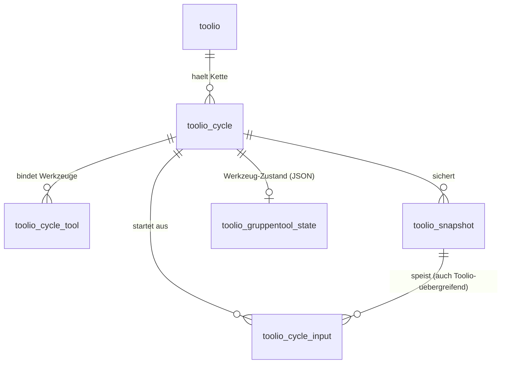

# ADR-0003: Datenmodell — Zyklus-Kette & Verkettung in `mod_toolio`

- **Status:** Akzeptiert
- **Datum:** 2026-07-29
- **Betrifft:** `mod_toolio`-Persistenz (`db/install.xml`), Werkzeug-Zustände,
  [01-konzept/00](../01-konzept/00-wie-toolio-funktioniert.md),
  [02-architektur/03](../02-architektur/03-daten-betrieb.md)

## Kontext

Das kanonische Modell ([00 · Wie Toolio funktioniert](../01-konzept/00-wie-toolio-funktioniert.md))
beschreibt eine Toolio-Aktivität als **Kette von Arbeitszyklen**. Jeder Zyklus läuft im
**Drei-Takt** 📝 Vorbereiten → ⏱️ Arbeiten → 💾 Sichern; das **Gesicherte** eines Zyklus wird
zum **Startmaterial** des nächsten (**Verkettung**). Zusätzlich gilt: eine Aktivität hält
**eine** Kette, und ein **zweites Toolio** im selben Kurs kann auf **gesicherte Ergebnisse**
des ersten zugreifen.

Der heutige Stand trägt das **nicht**:

- Die Tabelle `toolio` kennt nur `name`, `method`, `islive` — **keine Zyklen, keine
  Snapshots, keine Kette**.
- Der Weg-A-Durchstich (Router → Gruppentool) ist **rein clientseitig/provisorisch**: Der
  Zustand wird nirgends gespeichert. Bevor daraus echte Persistenz + Live-Freigabe wird,
  braucht es ein Fundament.

Eine Entscheidung ist nötig, weil das Datenschema **schwer umkehrbar** ist (Migrationen,
Backup/Restore, Privacy-Provider) und weil fast alle weiteren Werkzeug-Arbeiten darauf
aufsetzen. Wirkende Kräfte: Moodle-Kern (eigene Tabellen, Backup/Restore, Capabilities,
Privacy/DSGVO — siehe [03 · Daten & Betrieb](../02-architektur/03-daten-betrieb.md)),
Realtime-Versionierung ([ADR-0001](0001-realtime-sse-websockets.md)), Sicherung als
**bearbeitbares Excalidraw-JSON**, sowie der Wunsch nach **wenig Eigenbau**.

## Anforderungen an das Modell

1. **Kette:** geordnete Zyklen je Toolio (Verkettung = Reihenfolge + Kanten).
2. **Zyklus bindet 1..n Werkzeuge** (Methode „Placemat" = Board + Gruppentool).
3. **Sichern:** revidierbarer Zwischenstand je Zyklus (JSON), ggf. **pro Gruppe**.
4. **Verkettung:** ein Zyklus referenziert Snapshots als Startmaterial — auch aus einem
   **anderen Toolio** desselben Kurses.
5. **Werkzeug-Zustand** je Werkzeug mit **Versionsnummer** (Realtime-Konfliktbasis).
6. **Moodle-konform:** Backup/Restore, Privacy-Provider, Capabilities — kein Parallelsystem.

## Optionen

### Option A — Voll normalisiert
Alles relational: Zyklen, Werkzeug-Bindung, Snapshots, und je Werkzeug normalisierte Tabellen
(z. B. Gruppe, Mitglied, Board-Element …).
- Vorteile: sauber abfragbar; klare Integrität.
- Nachteile: viel Schema früh festgezurrt, obwohl Werkzeuge noch stark in Bewegung sind;
  passt schlecht zu Excalidraw-JSON und zum „ganzen Zustand pushen" der Realtime-Schicht;
  hoher Migrationsdruck bei jeder Werkzeug-Änderung.

### Option B — Dünnes Gerüst + JSON-Zustand je Werkzeug
Nur eine Aktivität + ein versionierter JSON-Blob je Werkzeug; Snapshots als JSON. Nah an
[03 · Daten & Betrieb](../02-architektur/03-daten-betrieb.md) („state mit Versionsnummer").
- Vorteile: minimale Schema-Fläche; passt zu Excalidraw-JSON und Whole-State-Realtime;
  Werkzeuge können intern frei iterieren.
- Nachteile: Kette/Verkettung und kursweiter Zugriff wären **in JSON versteckt** — schlecht
  abfragbar, schlecht für Backup/Restore und Privacy, riskant für die Cross-Toolio-Referenz.

### Option C — Hybrid: relationales Gerüst + JSON-Werkzeugzustand
Das **Rückgrat** (Toolio → Zyklen → Snapshots → Ketten-Kanten) ist **relational** und
abfragbar; der **werkzeuginterne Zustand** liegt als **versionierter JSON-Blob** je Werkzeug.
- Vorteile: Verkettung und Cross-Toolio-Zugriff sind echte, prüfbare Referenzen (Capabilities,
  Backup/Restore, Privacy greifen); zugleich bleiben Werkzeug-Interna flexibel und
  realtime-freundlich. Wenig Eigenbau am Kern, Freiheit an den Rändern.
- Nachteile: zwei Stilrichtungen im selben Schema; Grenze „Gerüst vs. Werkzeug-JSON" muss je
  Werkzeug bewusst gezogen werden.

## Entscheidung

**Akzeptiert: Option C (Hybrid).** Begründung: Genau die Dinge, die das Produkt
**quer** verbinden — die **Kette**, das **Sichern** und die **Verkettung** (inkl.
Cross-Toolio) — müssen relational und abfragbar sein, weil Moodle-Backup/Restore,
Privacy-Provider und Capability-Prüfungen daran hängen. Alles **werkzeuginterne** (Board-Fläche,
Gruppenaufteilung, Abfrage-Antworten) bleibt **versionierter JSON**, passend zu Excalidraw und
zur Whole-State-Realtime-Schicht ([ADR-0001](0001-realtime-sse-websockets.md)).

### Skizze (Vorschlag, nicht final)

**Rückgrat (werkzeugneutral, relational):**

| Tabelle | Zweck | Kernfelder (Skizze) |
|---|---|---|
| `toolio` *(vorhanden)* | Anker **einer** Kette | id, course, name, timecreated, timemodified |
| `toolio_cycle` | ein **Zyklus** in der Kette | id, toolioid, ordinal, method, sozialform, status(draft/live/saved), timemodified |
| `toolio_cycle_tool` | Werkzeuge des Zyklus (0..n; **0 = reine Sozialform**) | id, cycleid, tool, ordinal |
| `toolio_snapshot` | ein **gesicherter** Zwischenstand (Meilenstein) | id, cycleid, tool, ownertype(person/group/expectation), userid(null), groupno(null), payload(JSON — **ein Format**), timecreated |
| `toolio_cycle_input` | **Verkettung**: Zyklus startet aus Snapshot(s) | id, cycleid, snapshotid, ordinal |

**Werkzeug-Zustand (je Werkzeug, versionierter JSON-Blob):**

| Tabelle | Zweck | Kernfelder |
|---|---|---|
| `toolio_gruppentool_state` | Live-Zustand des Gruppentools | id, cycleid, version, payload(JSON: sozialform + Gruppen + Mitglieder), timemodified |
| `toolio_board_state`, … | analog je Werkzeug | id, cycleid, version, payload, timemodified |

> **Umsetzung ab Akzeptiert (2026-07-29).** Das Rückgrat wird schrittweise in
> `db/install.xml` + `db/upgrade.php` angelegt (mit `version.php`-Bump) — beginnend beim
> Gruppentool, das den Weg-A-Durchstich real persistiert. **Deploy erst nach separater
> Freigabe** (Push deployt automatisch).

## Konsequenzen

- **`install.xml`** bekommt bei Umsetzung zuerst das **Rückgrat**, dann je Werkzeug die
  `*_state`-Tabelle; `version.php` wird je Schritt erhöht (DB-Änderung).
- **`toolio.method`/`toolio.islive`** wandern konzeptionell in `toolio_cycle`
  (Methode + Status je Zyklus). Migration/Deprecation ist Teil der Umsetzung.
- **Backup/Restore & Privacy:** je neue Tabelle Backup-Definition und Privacy-Provider
  ergänzen (Snapshots/`*_state` enthalten Schüler-Bezug → DSGVO relevant).
- **Realtime:** die `version`-Spalte je `*_state` ist die Konfliktbasis für SSE
  ([ADR-0001](0001-realtime-sse-websockets.md)).
- **Weg-A-Slice:** bleibt provisorisch, bis das Gruppentool-Rückgrat + `toolio_gruppentool_state`
  stehen.

## Präzisierungen (PO-Entscheidungen 2026-07-29)

Die zuvor offenen Fragen sind entschieden:

1. **Ein Snapshot-Format für alles.** Jeder `toolio_snapshot` nutzt **eine** gemeinsame
   JSON-Hülle (Metadaten außen, werkzeugspezifischer Inhalt im `payload`). Board-Fläche
   (Excalidraw-JSON), Abfrage-Antworten und Chat-Verläufe teilen dieselbe Hülle.
2. **Ergebnis pro Person** — Gruppen- und LK-Ergebnis als Sonderfälle. Jeder Snapshot hat
   einen Erzeuger (`ownertype`): `person` (`userid`), `group` (`groupno`) oder `expectation`
   (der **Erwartungshorizont** = das Ergebnis der Lehrkraft). Das „Ergebnis eines Zyklus"
   ist die Menge dieser Snapshots.
3. **Sozialform gehört zum Zyklus.** Jede (Werkzeug-)Aktivität = ein Zyklus mit **einer**
   Sozialform (`toolio_cycle.sozialform`). Über die Verkettung kann jeder Zyklus eine andere
   Sozialform haben.
4. **Cross-Toolio: Referenz, nicht Kopie — mit Schutz vor Kettenbruch.** Beim Hereinziehen
   eines Snapshots aus einem anderen Toolio wird die **Leseberechtigung** auf die Quelle
   geprüft (Moodle-Capability). Standard ist eine **Referenz** (kein Kopieren, wie in 00
   beschrieben). Wird die Quelle gelöscht, wird der zuletzt gesicherte Stand **beim Löschen
   in den konsumierenden Zyklus eingefroren** (copy-on-delete) — die Kette reißt nicht.
5. **Methoden liefern eine editierbare Verkettungs-Vorlage.** Eine Methode setzt eine
   **Vorlage** aus Zyklen + Werkzeugen + Sozialform (z. B. Think-Pair-Share = Einzel → Paar
   → Plenum). Diese Vorlage ist **frei anlegbar und veränderbar**. Ein Zyklus hat **0..n**
   Werkzeuge (geordnet); **0** = reine Sozialform (Gruppen-/Partnerarbeit ohne Board o. ä.).
6. **Wenig, aber sinnvolle History — kein Datenchaos.** Persistent sind nur die **expliziten
   Sicherungen** (`toolio_snapshot` = Meilensteine der Kette). Der **Live-Arbeitszustand** je
   Werkzeug (`*_state`) ist **eine** Zeile mit `version`, die überschrieben wird — keine
   Keystroke-Historie.

## Noch offen (Umsetzungsdetail, nicht blockierend)

- Konkrete Feldliste der gemeinsamen Snapshot-Hülle (Envelope-Schema).
- Backup/Restore- und Privacy-Provider-Definition je neuer Tabelle.
- Feinregel, falls ein Zyklus **mehrfach** gesichert wird (Meilenstein ersetzen vs. anhängen).
